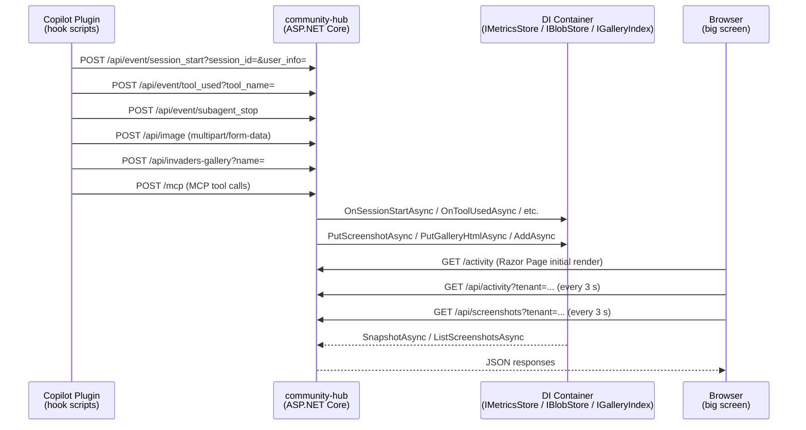
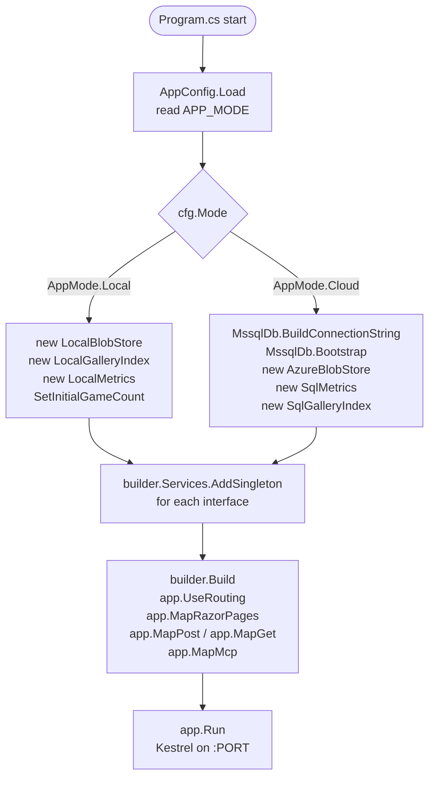
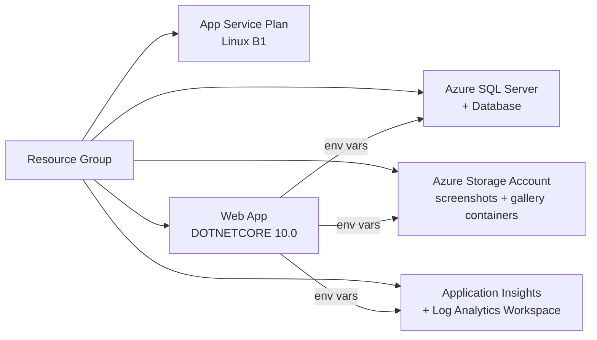

# Lab 502 Community Hub - .NET - Copilot Instructions

## Project Overview

`community-hub` is a real-time telemetry and Invaders Gallery hub for the Lab 502 Space Invaders workshop at Microsoft Build 2026, built with **ASP.NET Core 10**. It receives events from every attendee's Copilot CLI session, aggregates them, and displays live totals on a big-screen Live Activity Board alongside a scrolling screenshot gallery.

The .NET Lab 502 Community Hub also hosts a stateless HTTP Model Context Protocol (MCP) server at `/mcp`, backed by the same Community Hub operations used by the REST endpoints. MCP tools can list games, list screenshots, list tenants, read community activity, share games, and return direct upload instructions for games and screenshots.

The application runs in two modes:

| Mode    | Storage back-end                                              | Typical use |
|---------|---------------------------------------------------------------|-------------|
| `local` | In-memory activity counters + local filesystem blobs + JSON file index | Development, single-machine demos |
| `cloud` | Azure SQL (MSSQL) + Azure Blob Storage                         | Production event deployment       |

---

## Repository Layout

```
src/community-hub/
├── CommunityHub.slnx            # Solution file
├── PORTING-SEMANTICS.md               # Implementation notes and design decisions
├── CommunityHub/                # Main application project
│   ├── CommunityHub.csproj      # .NET 10, top-level statements
│   ├── Program.cs                     # Entry point: DI wiring, Minimal API route registration
│   ├── appsettings.json
│   ├── appsettings.Development.json
│   ├── Config/
│   │   └── AppConfig.cs               # Env-var config loader & validator
│   ├── Models/
│   │   └── Models.cs                  # ActivitySnapshot, ActivityApiView, GalleryEntry, GalleryListItem, ToolCount
│   ├── Pages/
│   │   ├── Activity.cshtml            # Live Activity Board (Razor Page)
│   │   ├── Activity.cs                # Razor Page model
│   │   ├── Gallery.cshtml             # Invaders gallery listing (Razor Page)
│   │   ├── Gallery.cshtml.cs          # Razor Page model
│   │   └── _ViewImports.cshtml
│   └── Services/
│       ├── Interfaces.cs              # IMetricsStore, IGalleryIndex, IBlobStore
│       ├── DashboardOperations.cs     # Shared app operations used by REST endpoints and MCP tools
│       ├── DashboardMcpTools.cs       # MCP tool definitions exposed by app.MapMcp("/mcp")
│       ├── LocalMetrics.cs            # In-memory IMetricsStore (lock + Dictionary/HashSet)
│       ├── LocalBlobStore.cs          # Filesystem IBlobStore
│       ├── LocalGalleryIndex.cs       # JSON-file IGalleryIndex
│       ├── MssqlDb.cs                 # Azure SQL connection + schema bootstrap
│       ├── SqlMetrics.cs              # SQL IMetricsStore
│       ├── SqlGalleryIndex.cs         # SQL IGalleryIndex
│       └── AzureBlobStore.cs          # Azure Blob IBlobStore (DefaultAzureCredential)
├── CommunityHub.Tests/          # xUnit test project
│   ├── AppConfigTests.cs              # 10 tests
│   ├── LocalMetricsTests.cs           # 10 tests
│   ├── LocalBlobStoreTests.cs         # 8 tests
│   ├── LocalGalleryIndexTests.cs      # 5 tests
│   └── ApiEndpointTests.cs            # 20 tests (WebApplicationFactory + Moq)
└── setup/
    ├── README.md
    ├── config.sh                      # Shared deployment env vars
    ├── provision.sh                   # az CLI: resource group + Bicep deploy
    ├── deploy.sh                      # dotnet publish + az webapp deploy --type zip
    ├── destroy.sh                     # Deletes the resource group
    ├── build-local.sh                 # Local build helper
    ├── main.bicep                     # Azure resources (local mode): App Service Plan + Web App
    ├── main-cloud.bicep               # Azure resources (cloud mode): adds SQL + Storage + App Insights
    └── modules/                       # Reusable Bicep modules
```

---

## Architecture

### Request Flow



### Component Diagram

```mermaid
graph TD
    subgraph "Program.cs"
        Kestrel["Kestrel HTTP server"]
        MinAPI["Minimal API routes\n(app.MapPost / app.MapGet)"]
        MCP["MCP HTTP transport\n/app.MapMcp(\"/mcp\")"]
        Razor["Razor Pages\n(/activity, /Gallery)"]
        AI["Application Insights\nAddApplicationInsightsTelemetry"]
    end

    subgraph "Config"
        CFG["AppConfig.Load()\nreads env vars"]
    end

    subgraph "Services — Interfaces"
        IMS[IMetricsStore]
        IGI[IGalleryIndex]
        IBS[IBlobStore]
    end

    subgraph "Local implementations"
        LM[LocalMetrics\nlock + HashSet + Dictionary]
        LG[LocalGalleryIndex\ngallery/index.json]
        LB[LocalBlobStore\nscreenshots/ + gallery/]
    end

    subgraph "Cloud implementations"
        SM[SqlMetrics\nAzure SQL]
        SG[SqlGalleryIndex\nAzure SQL]
        AB[AzureBlobStore\nAzure Blob]
        DB["MssqlDb.Bootstrap()\nschema DDL"]
    end

    CFG -->|AppMode.Local| LM & LG & LB
    CFG -->|AppMode.Cloud| SM & SG & AB & DB
    LM -->|registered as singleton| IMS
    LG -->|registered as singleton| IGI
    LB -->|registered as singleton| IBS
    SM -->|registered as singleton| IMS
    SG -->|registered as singleton| IGI
    AB -->|registered as singleton| IBS
    MinAPI --> IMS & IGI & IBS
    MCP --> IMS & IGI & IBS
    Razor --> IMS & IBS
```

### Mode Selection and Startup



---

## Features

### 1. Live Activity Board (`GET /activity`)

Handled by the `Activity` Razor Page (`Pages/Activity.cshtml` + `Activity.cs`). The page renders an initial snapshot server-side using `@Model.Snapshot.*` and then polls the JSON API every 3 seconds to update values without a full reload.

Displays seven aggregate counters in two columns: the selected/current tenant and an all-tenants aggregate:

- **Sessions** — distinct session IDs received
- **Distinct Users** — distinct user identifiers received
- **Tool Calls** — total tool invocation count
- **Distinct Tools Called** — number of unique tools called
- **Subagents Finished** — subagent stop events
- **Screenshots** — screenshot uploads
- **Uploaded Games** — game HTML uploads

Also shows a **Tools** table with selected/current-tenant and all-tenant counts, a tenant selector in the top-right header, and an auto-scrolling **Screenshot Gallery** sidebar.

Client-side JavaScript (`fetch`) polls `/api/activity?tenant=<selected>` and `/api/screenshots?tenant=<selected>` every **3 seconds** and patches the DOM. Gallery re-renders only when the screenshot URL list changes (signature-based comparison). Auto-scroll advances 1 px every 40 ms.

### 2. Invaders Gallery (`GET /Gallery`)

Handled by the `Gallery` Razor Page. Renders a styled list of uploaded games for the selected tenant; each entry links to its stored HTML file in a new tab. The top-right header includes a tenant selector.

### 3. Event Recording API

All event endpoints accept `POST` and return `200 OK`. Errors are caught and logged but never surfaced to the caller (hook scripts must not block).

| Endpoint | Query params | Effect |
|---|---|---|
| `POST /api/event/session_start` | `session_id`, `user_info` | `OnSessionStartAsync` — tracks distinct sessions and users |
| `POST /api/event/user_prompt_submitted` | — | No-op; returns 200 (reserved) |
| `POST /api/event/tool_used` | `tool_name` | `OnToolUsedAsync` — increments total + per-tool counter |
| `POST /api/event/subagent_stop` | — | `OnSubagentStopAsync` — increments counter |

### 4. Screenshot Upload & Serving

- `POST /api/image` — multipart `image` field; GUID filename; `PutScreenshotAsync`; increments screenshot counter.
- `GET /api/screenshots?tenant=<tenant>` — JSON array of screenshot URLs. `tenant` is optional; when omitted, the configured current tenant is used.
- `GET /api/screenshots/{name}` — **local mode only** — serves raw image file.

### 5. Game Gallery Upload & Listing

- `POST /api/invaders-gallery?name=<display-name>` — reads HTML body (max 200 KB, enforced via manual stream-length check); GUID filename; `PutGalleryHtmlAsync`; `AddAsync`; increments game counter. Returns `{"name":"…","url":"…"}`.
- `GET /api/invaders-gallery/list?tenant=<tenant>` — JSON array of `{name, url}` objects. `tenant` is optional; when omitted, the configured current tenant is used.
- `GET /api/gallery/{name}` — **local mode only** — serves HTML file (`Content-Type: text/html`).

### 6. Activity Data API

`GET /api/activity?tenant=<tenant>` returns the selected tenant activity snapshot. `tenant` is optional; when omitted, the configured current tenant is used. `activity.current_tenant` contains the tenant-scoped counters, `activity.all_tenants` contains the aggregate across all tenants, and `tools` contains per-tool counts for both scopes:

```json
{
    "tenant": "local",
    "activity": {
        "current_tenant": {
            "session_count": 0,
            "user_count": 0,
            "tool_calls": 0,
            "distinct_tools_called": 0,
            "subagent_stops": 0,
            "screenshot_count": 0,
            "uploaded_games_count": 0
        },
        "all_tenants": {
            "session_count": 0,
            "user_count": 0,
            "tool_calls": 0,
            "distinct_tools_called": 0,
            "subagent_stops": 0,
            "screenshot_count": 0,
            "uploaded_games_count": 0
        }
    },
    "tools": {
        "current_tenant": [{ "name": "shell", "count": 42 }],
        "all_tenants": [{ "name": "shell", "count": 42 }]
  }
}
```

All JSON property names use `snake_case` (`[JsonPropertyName("…")]`). Tool breakdown lists are sorted by count descending, then name ascending.

`GET /api/tenants` returns `{ "current_tenant": "...", "tenants": ["..."] }` for populating the activity and gallery tenant selectors.

### 7. OpenAPI Specification

`GET /api/openapi.json` — serves an OpenAPI 3.1.0 document. The `servers[0].url` is set to `cfg.DashboardBaseUrl`.

### 8. MCP Server

`POST /mcp` — stateless HTTP MCP endpoint registered with `ModelContextProtocol.AspNetCore` via `AddMcpServer().WithHttpTransport(options => options.Stateless = true).WithToolsFromAssembly()` and `app.MapMcp("/mcp")`. The explicit route is required because bare `app.MapMcp()` maps the SDK endpoint at the app root by default.

Screenshot uploads use a direct HTTP path from the agent host to the Lab 502 Community Hub:

- `get_screenshot_upload_instructions` returns the direct `POST /api/image` upload URL, required multipart field name, and an optional example command.
- Agents must upload the local screenshot file directly to the returned URL. Do not read the image file, check its size, base64-encode it, or pass image bytes through MCP tool arguments.

MCP tool definitions live in `Services/DashboardMcpTools.cs` and delegate to `Services/DashboardOperations.cs` so MCP and REST behavior stay aligned.

| Tool | Arguments | Returns | Notes |
|---|---|---|---|
| `ListGames` | optional `limit`, optional `tenant` | `List<GalleryListItem>` | Same tenant resolution and list limit normalization as `/api/invaders-gallery/list`. |
| `ListScreenshots` | optional `tenant` | `List<string>` | Returns screenshot URLs for the selected/current tenant. |
| `GetCommunityActivity` | optional `tenant` | `ActivityApiView` | Includes `activity.current_tenant`, `activity.all_tenants`, and per-tool counts for both scopes. |
| `ListTenants` | — | `TenantsApiView` | Returns `current_tenant` and discovered tenants. |
| `GetShareGameInstructions` | optional `htmlPath`, optional `name` | `ShareGameInstructions` | Returns direct upload details and an optional example command. Agents should pass `htmlPath` directly without reading the file; HTML files go through `/api/invaders-gallery`, not MCP context. |
| `GetScreenshotUploadInstructions` | optional `imagePath` | `ScreenshotUploadInstructions` | Returns direct upload details and an optional example command. Screenshot bytes should go directly through `/api/image`, never through MCP context. |

Keep new MCP tools thin: add shared behavior to `DashboardOperations` first, then expose it from `DashboardMcpTools`.

---

## Service Interfaces

All Minimal API route handlers and Razor Page models depend only on the three interfaces in `Services/Interfaces.cs`. Implementations are registered as singletons in the DI container.

### `IMetricsStore`

```csharp
public interface IMetricsStore
{
    string CurrentTenant { get; }
    Task OnSessionStartAsync(string sessionId, string userId);
    Task OnToolUsedAsync(string tool);
    Task OnSubagentStopAsync();
    Task OnScreenshotUploadedAsync();
    Task OnGameUploadedAsync();
    Task<ActivitySnapshot> SnapshotAsync(string? tenant = null);
    Task<ActivitySnapshot> AllTenantsSnapshotAsync();
    Task<(ActivitySnapshot Tenant, ActivitySnapshot AllTenants)> SnapshotWithAllTenantsAsync(string? tenant = null);
    Task<List<string>> ListTenantsAsync();
}
```

### `IGalleryIndex`

```csharp
public interface IGalleryIndex
{
    string CurrentTenant { get; }
    Task AddAsync(GalleryEntry entry);
    Task<List<GalleryEntry>> ListAsync(int? limit = null, string? tenant = null);
    Task<int> CountAsync(string? tenant = null);
    Task<List<string>> ListTenantsAsync();
}
```

### `IBlobStore`

```csharp
public interface IBlobStore
{
    string CurrentTenant { get; }
    Task<string> PutScreenshotAsync(string name, Stream data, string contentType);
    Task<string> PutGalleryHtmlAsync(string name, byte[] data);
    Task<List<string>> ListScreenshotsAsync(string? tenant = null);
    string ServeScreenshot(string name, string? tenant = null);
    string ServeGalleryHtml(string name, string? tenant = null);
    bool IsLocalServing { get; }
}
```

`IsLocalServing` returns `true` in local mode; `Program.cs` uses this flag to decide whether to register the file-serving routes.

---

## Local Mode Implementation Details

### `LocalMetrics`

- `HashSet<string>` for sessions and users (blank string skipped).
- `Dictionary<string, int>` for per-tool counts.
- All mutations guarded by a `lock` statement.
- `SetInitialGameCount(n)` seeds `_uploadedGames` from the pre-existing gallery count on startup.
- `SnapshotAsync` sorts `tool_breakdown` by count descending, then name ascending.

### `LocalBlobStore`

- Creates `{LocalDataDir}/screenshots/` and `{LocalDataDir}/gallery/` on construction.
- `PutScreenshotAsync` writes to disk, returns a `/api/screenshots/{name}` URL.
- `PutGalleryHtmlAsync` writes to disk, returns a `/api/gallery/{name}` URL.
- `ListScreenshotsAsync` returns filenames sorted alphabetically.
- `IsLocalServing` is always `true`.
- `ScreenshotsDir` and `GalleryDir` are exposed as properties for the file-serving routes in `Program.cs`.

### `LocalGalleryIndex`

- Persists to `{LocalDataDir}/gallery/index.json` as a JSON array of `GalleryEntry`.
- Mutations guarded by `lock`. Missing or empty file treated as an empty list.

---

## Cloud Mode Implementation Details

### Azure SQL (`MssqlDb` + `SqlMetrics` + `SqlGalleryIndex`)

Connection string built by `MssqlDb.BuildConnectionString` and uses **Azure AD `Active Directory Default`** authentication. Schema bootstrapped idempotently by `MssqlDb.Bootstrap`, which splits the embedded DDL on `---BATCH---` and executes each batch in sequence.

**Tables:**

| Table | Purpose |
|---|---|
| `sessions` | One row per `(tenant, session_id)`; distinct sessions and users tracked here |
| `tool_counts` | One row per `(tenant, tool_name)`; MERGE upsert on every `tool_used` event |
| `counters` | Generic counter rows; MERGE upsert |
| `gallery` | One row per uploaded game; ordered by `uploaded_at ASC` |
| `events` | Audit log; one row per event received |

Counter upserts use `MERGE WITH (HOLDLOCK)` to avoid races under concurrent load. All operations use explicit `SqlTransaction` with rollback on failure.

### Azure Blob Storage (`AzureBlobStore`)

- Authenticates via `Azure.Identity.DefaultAzureCredential`.
- Blob names prefixed with the tenant: `{tenant}/{filename}`.
- **Screenshots container** (`screenshots`): cache header `public, max-age=31536000, immutable`.
- **Gallery container** (`gallery`): cache header `public, max-age=300`.
- Public URL: `{AzureBlobPublicBase}/{container}/{tenant}/{name}`.
- `IsLocalServing` is always `false`.

---

## Configuration

All configuration is read by `Config/AppConfig.Load()`. Invalid values throw `InvalidOperationException` at startup.

| Variable | Default | Required in | Description |
|---|---|---|---|
| `APP_MODE` | `local` | Always | `local` or `cloud` |
| `PORT` | `1345` | Always | Kestrel listen port |
| `LOCAL_DATA_DIR` | `.` | Local | Directory for screenshots, gallery, index |
| `APP_TENANT` | — | Cloud | Tenant identifier; must match `^[a-z0-9][a-z0-9-]{0,30}$` |
| `SQL_SERVER` | — | Cloud | Azure SQL Server FQDN |
| `SQL_DATABASE` | `dashboard` | Cloud | Database name |
| `AZURE_STORAGE_ACCOUNT` | — | Cloud | Storage account name |
| `AZURE_BLOB_PUBLIC_BASE` | — | Cloud | Public blob base URL |
| `APPLICATIONINSIGHTS_CONNECTION_STRING` | — | Optional | App Insights connection string |
| `LAB502_DASHBOARD_URL` | — | Optional | Community Hub base URL (falls back to `DASHBOARD_URL`, then `http://localhost:{PORT}`) |

---

## Observability

When `APPLICATIONINSIGHTS_CONNECTION_STRING` is set, `builder.Services.AddApplicationInsightsTelemetry(...)` is called. This integrates the full ASP.NET Core telemetry pipeline: automatic request tracking, dependency tracking, and exception telemetry.

Startup and mode information are written to `Console` (stdout).

---

## Security Considerations

- **`IsSafeServedFilename(name, requiredExt)`** (static helper in `Program.cs`) — rejects empty names, names with `/` or `\`, path traversal (`..`), and names where `Path.GetFileName(name) != name`. Optionally enforces a required file extension (`.html` for gallery files). Applied to all file-serving routes.
- **Gallery HTML upload** capped at **200 KB** — enforced by reading the body into a `MemoryStream` and checking `.Length`.
- Event endpoint errors are caught, logged to console, and never surfaced to the caller (always `200 OK`).
- Activity/gallery read APIs accept an optional `tenant` query parameter. Tenant values are validated with `^[a-z0-9][a-z0-9-]{0,30}$` before use and are parameterized in SQL queries.
- Activity data is read-only and contains no PII.

---

## Testing

The `CommunityHub.Tests` project uses **xUnit**, **WebApplicationFactory**, and **Moq**. Run with:

```bash
dotnet test CommunityHub.Tests/
```

Test classes:

| Class | Tests | What is covered |
|---|---|---|
| `AppConfigTests` | 10 | Config loading, defaults, fallback chain, invalid values, cloud mode validation |
| `LocalMetricsTests` | 10 | In-memory activity: session/user dedup, tool counts, sorting, seeding |
| `LocalBlobStoreTests` | 8 | Directory creation, file write/read, URL patterns, listing |
| `LocalGalleryIndexTests` | 5 | Empty list, add/list, count, JSON persistence |
| `ApiEndpointTests` | 20 | All event endpoints, activity JSON, screenshots, gallery upload/list, OpenAPI, HTML pages, path traversal, method validation |

---

## Deployment

### Local development

```bash
cd src/community-hub
dotnet run --project CommunityHub/CommunityHub.csproj
# App starts on http://localhost:1345
```

### Azure (local mode — App Service without SQL/Blob)

```bash
cd src/community-hub/setup
./provision.sh
./deploy.sh
```

`deploy.sh` runs `dotnet publish` and deploys a zip package via `az webapp deploy --type zip`. No container registry needed.

### Azure (cloud mode — App Service + SQL + Blob + App Insights)

```bash
cd src/community-hub/setup
export DEPLOY_MODE=cloud
export APP_TENANT=my-tenant
./provision.sh
./deploy.sh
```

The Bicep template (`main-cloud.bicep`) provisions:



---

## Coding Conventions

- **Minimal APIs** in `Program.cs` — do not add controllers or separate route files.
- All service interfaces are in `Services/Interfaces.cs`; implementations are in separate files in `Services/`.
- New store operations must be added to the interface *and* all four implementations (`LocalMetrics`, `LocalBlobStore`/`LocalGalleryIndex`, `SqlMetrics`/`SqlGalleryIndex`, `AzureBlobStore`).
- JSON property names always use `[JsonPropertyName("snake_case")]` on model properties.
- File-serving routes must call `IsSafeServedFilename` before any filesystem access.
- GUID filenames use `GenerateGuid()` (16 bytes from `RandomNumberGenerator`, formatted as `xxxxxxxx-xxxx-xxxx-xxxx-xxxxxxxxxxxx`).
- Tests use `WebApplicationFactory` with mocked services via Moq — do not introduce real filesystem or network dependencies in tests.
- `Services/OpenApiSpecBuilder.cs` must be updated whenever a new endpoint is added.
