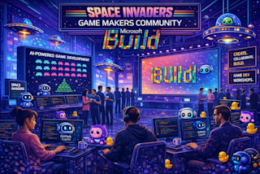

<p align="center">

</p>

# [Microsoft Build 2026](https://build.microsoft.com)

## 🔥 LAB502: Make GitHub Copilot Work Your Way: Custom Tools, Context and Workflows

GitHub Copilot is powerful out of the box, but custom tools, context, and workflows let you shape it to fit how your team actually works. In this hands-on lab, you’ll build a browser-based Space Invaders game with Copilot, then customize Copilot across the command line and Visual Studio Code using plugins, hooks, agents, skills, instructions, prompts, and MCP servers. You’ll leave with practical patterns and working customizations you can adapt to your own codebase.



### 🏫 Getting started in a guided session

To get started in a guided lab session:
- Log in to your assigned lab VM using the credentials provided
- Follow the step-by-step instructions provided in the sidebar

### 🏠 Getting started in your own environment

If you're following these steps at your own pace, see the [self-paced setup guide](docs/self-paced-setup.md) for full instructions, including prerequisites with explanations, how to run the Community Hub locally, and browser configuration for screenshot sharing.

### 🧠 Learning Outcomes

By the end of this lab, you will be able to:

- Build a browser-based game with GitHub Copilot by using plan mode, clear prompts, and custom context to guide agentic development.
- Explain how Copilot customizations such as instructions, prompt files, skills, custom agents, hooks, MCP servers, and plugins fit different workflow needs.
- Create and apply Copilot customizations in Visual Studio Code and GitHub Copilot CLI, then connect them to external tools and services through MCP.

### 💬 Keep Learning with Copilot

Try these prompts with GitHub Copilot to explore the topics from this lab. Open Copilot Chat in Visual Studio Code (`Ctrl+Alt+I` on Windows/Linux, `Cmd+Shift+I` on Mac), paste a prompt, and see what you learn. Try connecting the [Microsoft Learn MCP Server](#-microsoft-learn-mcp-server) for the latest official documentation.

Use these as a starting point — or write your own!

1. Understand Copilot customization types:

```
Explain the difference between custom instructions, prompt files, skills, and custom agents in GitHub Copilot. When should I use each one?
```

2. Explore MCP servers:

```
Using the Microsoft Learn MCP Server, find the latest documentation on Model Context Protocol and explain how to connect an MCP server to Visual Studio Code
```

3. Build your own skill:

```
Help me create a GitHub Copilot agent skill that reads a local JSON file and posts its contents to a REST API endpoint. Include SKILL.md with a clear description and a helper script.
```

4. Set up repository-wide guardrails:

```
Generate a .github/copilot-instructions.md file for a C# .NET project that enforces nullable reference types, requires unit tests for new public methods, and follows the conventional commits specification
```

5. Combine customizations:

```
Design a Copilot plugin that bundles a custom agent, two skills, and a post-edit hook for auto-formatting. Show the folder structure and the plugin.json manifest.
```

### 💻 Technologies Used

1. [GitHub Copilot](https://docs.github.com/copilot)
1. [GitHub Copilot CLI](https://docs.github.com/en/copilot/how-tos/set-up/install-copilot-cli)
1. [Visual Studio Code](https://code.visualstudio.com/docs/copilot/overview)
1. [Playwright](https://learn.microsoft.com/microsoft-edge/playwright/)
1. [Playwright MCP server](https://playwright.dev/docs/getting-started-mcp)

### 📚 Resources and Next Steps

| Resource | Description |
|:---------|:------------|
| [GitHub Copilot documentation](https://docs.github.com/en/copilot) | Official GitHub Copilot docs covering all features and platforms |
| [Awesome GitHub Copilot Learning Hub](https://awesome-copilot.github.com/learning-hub/) | Curated learning resources, tutorials, and best practices for GitHub Copilot |
| [What are Agents, Skills, and Instructions](https://awesome-copilot.github.com/learning-hub/what-are-agents-skills-instructions/) | Deep dive into the customization primitives used in this lab |
| [Visual Studio Code Copilot customization overview](https://code.visualstudio.com/docs/copilot/concepts/customization) | Official docs for instructions, prompts, skills, agents, hooks, and plugins in Visual Studio Code |
| [GitHub Copilot CLI for Beginners](https://awesome-copilot.github.com/learning-hub/cli-for-beginners/) | Getting started guide for the Copilot command-line interface |
| [Playwright MCP server](https://github.com/microsoft/playwright-mcp) | Connect browser automation to AI coding assistants via Model Context Protocol |
| [Microsoft Learn MCP Server](https://learn.microsoft.com/training/support/mcp-get-started) | Access official Microsoft documentation directly from GitHub Copilot |
| [Build 2026 — Next steps](https://aka.ms/build26-next-steps) | Continue your learning journey after Build 2026 |

### 🌟 Microsoft Learn MCP Server

[](https://vscode.dev/redirect/mcp/install?name=microsoft.docs.mcp&config=%7B%22type%22%3A%22http%22%2C%22url%22%3A%22https%3A%2F%2Flearn.microsoft.com%2Fapi%2Fmcp%22%7D)

The Microsoft Learn MCP Server is a remote MCP Server that enables clients like GitHub Copilot and other AI agents to bring trusted and up-to-date information directly from Microsoft's official documentation. Get started by using the one-click button above for Visual Studio Code or access the [mcp.json](.vscode/mcp.json) file included in this repo.

For more information, setup instructions for other dev clients, and to post comments and questions, visit our Learn MCP Server GitHub repo at [https://github.com/MicrosoftDocs/MCP](https://github.com/MicrosoftDocs/MCP). Find other MCP Servers to connect your agent to at [https://mcp.azure.com](https://mcp.azure.com).

*Note: When you use the Learn MCP Server, you agree with [Microsoft Learn](https://learn.microsoft.com/en-us/legal/termsofuse) and [Microsoft API Terms](https://learn.microsoft.com/en-us/legal/microsoft-apis/terms-of-use) of Use.*

## Content Owners

<table>
<tr>
    <td align="center"><a href="https://github.com/tspascoal">
        <br />
        <sub><b>tspascoal</b></sub></a><br />
            <a href="https://github.com/tspascoal" title="talk">📢</a>
    </td>
    <td align="center"><a href="https://github.com/joshjohanning">
        <br />
        <sub><b>joshjohanning</b></sub></a><br />
            <a href="https://github.com/joshjohanning" title="talk">📢</a>
    </td>
</tr></table>

## Contributing

This project welcomes contributions and suggestions.  Most contributions require you to agree to a
Contributor License Agreement (CLA) declaring that you have the right to, and actually do, grant us
the rights to use your contribution. For details, visit [Contributor License Agreements](https://cla.opensource.microsoft.com).

When you submit a pull request, a CLA bot will automatically determine whether you need to provide
a CLA and decorate the PR appropriately (e.g., status check, comment). Simply follow the instructions
provided by the bot. You will only need to do this once across all repos using our CLA.

This project has adopted the [Microsoft Open Source Code of Conduct](https://opensource.microsoft.com/codeofconduct/).
For more information see the [Code of Conduct FAQ](https://opensource.microsoft.com/codeofconduct/faq/) or
contact [opencode@microsoft.com](mailto:opencode@microsoft.com) with any additional questions or comments.

## Trademarks

This project may contain trademarks or logos for projects, products, or services. Authorized use of Microsoft
trademarks or logos is subject to and must follow
[Microsoft's Trademark & Brand Guidelines](https://www.microsoft.com/legal/intellectualproperty/trademarks/usage/general).
Use of Microsoft trademarks or logos in modified versions of this project must not cause confusion or imply Microsoft sponsorship.
Any use of third-party trademarks or logos are subject to those third-party's policies.
