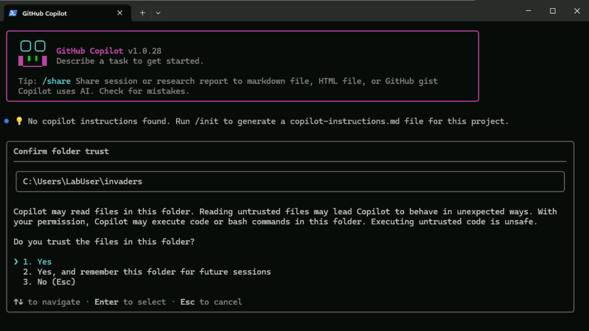

# Setting up the environment

> [!Hint]
> Under regular conditions you would need to ensure all prerequisites are installed, but don't worry. We have ensured this environment has all you need.


> [!NOTE]
> GitHub Copilot uses Large Language Models (LLMs), which generate responses probabilistically rather than deterministically. This means that the exact suggestions, code, and interactions you see may differ from what's shown in these instructions. This is normal and expected behavior! Use your best judgment to adapt the suggestions to your needs, and don't hesitate to iterate with Copilot if the first suggestion isn't quite right.

> [!TIP]
> Throughout this lab you will type or paste prompts directly into Copilot CLI in the terminal. In Windows Terminal, you can **right-click** to copy selected text to the clipboard (in addition to <kbd>Ctrl</kbd>+<kbd>C</kbd>). Right-clicking again pastes from the clipboard, which is handy for longer prompts from these instructions.

## GitHub Copilot CLI - Login

1.  Open a terminal of your choice. It is recommended that you maximize the terminal window.
2.  Create an **invaders** directory, navigate into it, and initialize a git repository by running the following commands:
```
mkdir invaders
cd invaders
git init
```
3.  Press <kbd>Enter</kbd> to ensure the last command (git init) is executed.

4.  Run `copilot update` (and press <kbd>Enter</kbd>) to ensure you have the latest version of GitHub Copilot CLI (you could also run `/update` from within a Copilot session, but let's do it upfront this time).
5.  Open a Copilot CLI session by running `copilot` at the shell prompt (and press <kbd>Enter</kbd>).



6.  After the intro animation, you will be prompted to confirm if you trust the current directory. Select **Yes, and remember this folder for future sessions**, or just press <kbd>2</kbd> to proceed. (Tip: every choice in Copilot CLI can be selected by pressing the corresponding number key — no need to use the arrow keys and <kbd>Enter</kbd>.)
7.  When asked if you want to set up the terminal for multi-line support, select **Yes**. This will allow you to write longer prompts by hitting <kbd>Shift</kbd>+<kbd>Enter</kbd>.
8.  Type `/login` and press <kbd>Enter</kbd> in the Copilot CLI session, then follow the on-screen prompts to authenticate with your GitHub account.

	> [!NOTE]
	> You can skip this step if you are already signed in to GitHub Copilot CLI from a previous session.

9.  Once authentication completes, Copilot is ready to use in your terminal. You should also see that your account is automatically connected to the GitHub MCP server.

> [!NOTE]
> Having a git repository is not strictly necessary to use Copilot CLI, but it lets you take advantage of features such as rewinding a change.

### Copilot CLI basic usage

Once inside the interactive session, you can start using Copilot CLI right away. Here's a quick overview of the essentials (no need to do any of these right now — just read through to get familiar if you feel like it):

**Typing prompts:** Simply type your question or request in natural language and press Enter. For example:

```
> Explain what a dataclass is in Python in simple terms
```

**Executing shell commands:** Prefix a command with `!` to run it directly in your local shell without leaving the session:

```
> ! git status
```

(once you type **!** Copilot will switch to shell command mode)


**Including file context:** Use `@` followed by a filename to include its contents in your prompt:

```
> Review @src/app.py for code quality issues
```

**Slash commands:** These built-in commands control your session:

| Command | Description |
|---------|-------------|
| /help | Show all available commands |
| /clear | Clear conversation and start fresh |
| /model | Show or switch the AI model |
| /exit  | End the session |

**Navigating history:** Use the up/down arrow keys to cycle through your previous prompts.

**Switching modes:** Press <kbd>Shift</kbd>+<kbd>Tab</kbd> to cycle between **Interactive**, **Plan**, and **Autopilot** modes.

**Permission prompts:** When Copilot wants to perform an action (e.g., run a command or edit a file), it will ask for permission — unless you have enabled autopilot mode with all permissions granted.

We are now ready to start working on our code with the help of Copilot.

## Summary and Next Steps

You have successfully logged in to GitHub Copilot CLI and are now ready to use it to assist with your coding tasks. In the next section, we will tap into your creativity to create a game (no spoilers, but it's going to be fun!).

<div class="invis">[← Previous: Introduction](00-intro.md) | [Next: Installing the community plugin →](02-installing-the-community-plugin.md)</div>

## Resources

- [GitHub Copilot CLI for Beginners][copilot-cli-for-beginners]
- [About GitHub Copilot CLI][copilot-cli-about]
- [GitHub Copilot CLI command reference][copilot-cli-command-reference]
- [GitHub Copilot model comparison][copilot-model-comparison]

[copilot-cli-for-beginners]: https://awesome-copilot.github.com/learning-hub/cli-for-beginners/
[copilot-cli-about]: https://docs.github.com/en/copilot/concepts/agents/copilot-cli/about-copilot-cli
[copilot-cli-command-reference]: https://docs.github.com/en/copilot/reference/copilot-cli-reference/cli-command-reference
[copilot-model-comparison]: https://docs.github.com/en/copilot/reference/ai-models/model-comparison
