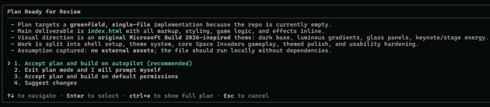
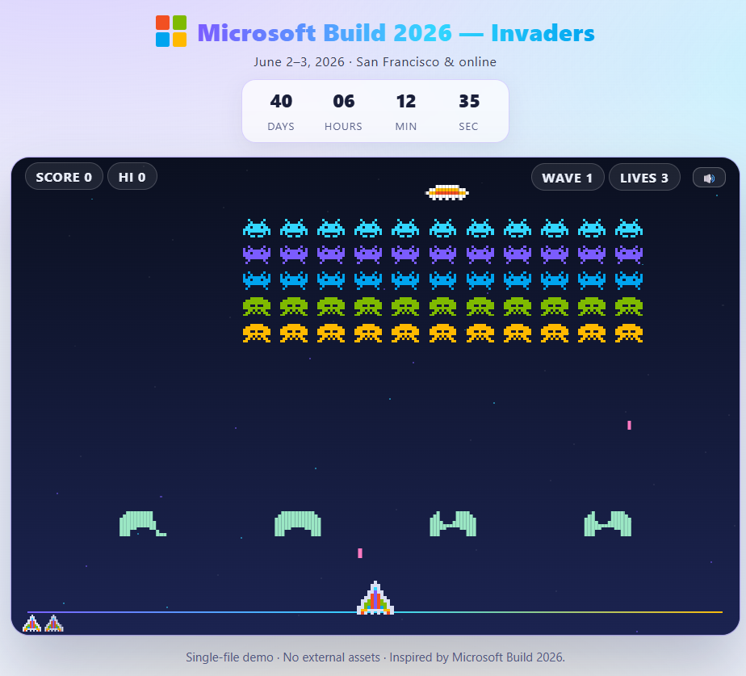
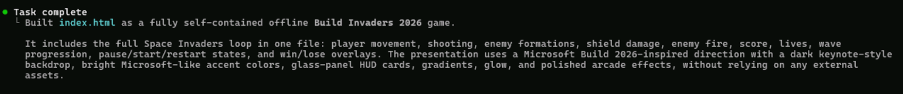

# Generating the Space Invaders game

## Plan Mode

GitHub Copilot CLI has two agentic modes, both support full tool-calling abilities. The default is **agent mode** (sometimes called execute mode), where Copilot immediately starts implementing your request. The second is **plan mode**, which takes a deliberate, collaborative approach before any code is written.

Press <kbd>Shift</kbd>+<kbd>Tab</kbd> to cycle between modes. In plan mode, the experience is conversational: Copilot uses the **ask_user** tool to prompt you with follow-up questions, confirm assumptions about feature scope, and get your input on design decisions. Once you're aligned on the approach, Copilot produces a structured implementation plan you can review in a dedicated panel — and only then, once you approve, does it start writing code. This helps you catch misunderstandings early, make informed decisions about implementation approach, and stay in control of complex, multi-step tasks.

## Scenario

> [!NOTE]
> Prefer to skip the generation step? Two pre-generated games are available on the desktop:
> - **Blockcraft-Invaders.html** — a Minecraft-themed Space Invaders.
> - **Build2026-Invaders.html** — a Microsoft Build 2026-themed Space Invaders.
>
> Copy either file into your workspace and open it in a browser to play. That said, we encourage you to try generating your own at least once — it's a great way to get hands-on with Copilot's plan mode, and it's fun :)
> If you go this route, there are some prompts later that will need some adjustment since they refer to the generated file, but nothing major.

1. [] Start Copilot by running `copilot` at the shell prompt and pressing <kbd>Enter</kbd>. If you did not quitted the previous session, run `/quit` first, then start Copilot again.
2. [] Select the model you are going to use. We have pre-selected **GPT-5.4** with **low** effort for you (you can see the selected model in the Copilot status bar at the bottom right of the terminal) by saving it in the Copilot config file. To pick a different model, run `/model` and choose one (we recommend **GPT 5.4** or **Claude Sonnet 4.6**). If you change the model, please make sure to select **low** effort for faster results.
3. [] Switch to plan mode by pressing <kbd>Shift</kbd>+<kbd>Tab</kbd> until **Plan** appears in the status bar (bottom right) — or, even simpler, start your prompt with **/plan** to switch to plan mode automatically and generate a plan for your task.
4. [] **This is where we ask you to be creative** and generate a distinctive game; later you will use Copilot to easily share your results with the other attendees. Below is an example **base prompt** (it is very important to indicate that we want the game in a single HTML file so it can be shared easily). You can use this base prompt and add your own twist to it, or write your own prompt entirely (as long as you ask for a single HTML output):

	`/plan Generate a Space Invaders game in a single HTML file`

	When generating a plan, be as specific as possible to get a more accurate result. For example, you could ask for a specific theme, or specific features (high-score tracking, multiple levels, sound, mobile support and so on). With an ambiguous prompt, Copilot may do one of two things: (1) ask clarifying questions to better understand the requirements and scope, or (2) make assumptions and generate a plan based on those assumptions. Both are valid, but it is important to be aware of them and provide feedback to Copilot if the assumptions are wrong or the clarifying questions are not relevant.

	

	> [!TIP]
	> You can use the **web_fetch** tool to pull data from the internet to feed more context to Copilot. For example, we used the following prompt to generate a Microsoft Build 2026 theme for our game:
	>
	> `/plan Generate a Space Invaders game in a single HTML file with a Microsoft Build 2026 theme. See the content of https://www.microsoft.com/en-us/build to get inspiration for the theme, colors, and style of the game.`
	>
	> Simple, effective, and intentionally open-ended. It gives Copilot useful context, but still leaves a lot of creative control to the model. We are sure you can be more creative than us :)

5. [] When Copilot is finished with the plan, you can review it, execute it, or refine it. Once Copilot shows **Plan Ready for Review**, press <kbd>Ctrl</kbd>+<kbd>E</kbd> to review inside Copilot or press <kbd>Ctrl</kbd>+<kbd>Y</kbd> to see the plan in Visual Studio Code.

	

6. [] Select the option **Accept plan and build on autopilot**. (**If** Copilot only shows **Accept plan and build on default permissions**, select it and then run `/allow-all` to switch to autopilot mode.)

> [!TIP] Copilot also presents you with other options:
>	- **Accept plan and build on default permissions** — Copilot will execute the plan but ask for your permission before each step that requires permissions. This is a good option when you want more control over execution and don't mind being interrupted.
>	- **Exit plan mode and I will prompt myself** — the plan stays in context and you drive the execution yourself. This is a great opportunity to use the **/fleet** command to execute the plan across a fleet of subagents in parallel — for example, with different prompts or models to compare results. You could also use **/delegate** to hand off execution to a cloud agent.
>	- **Suggest changes** — ask Copilot to refine the plan if it isn't aligned with what you want, or if some steps are missing or need to change (for example, adding sound effects or changing the theme).



### The plugin behind the scenes

While Copilot does its thing and generates the code for the game, you can watch the progress in the Copilot interface and see the different steps being executed.

Let's take this opportunity to browse the plugin we installed in the previous module. The full source for the plugin is available on [GitHub](https://github.com/microsoft/Build26-LAB502-make-github-copilot-work-your-way-custom-tools-context-and-workflows/tree/main/src/plugins/space-invaders-makers). The **src/plugins/space-invaders-community-plugin** folder contains four subfolders:
- **agents**: Contains the **web-screenshotter** agent, which uses the [Playwright MCP](https://github.com/microsoft/playwright-mcp) server to navigate to a URL ([Playwright](https://playwright.dev/) can do a lot of other things as well), capture a full-page screenshot, and automatically share it via the **share-screenshot** skill.
- **skills/share-screenshot**: A skill that uploads a screenshot file to the Lab 502 Community Hub. It is used by the **web-screenshotter** agent after capturing a screenshot, but can also be invoked independently to share any screenshot.
- **scripts**: The scripts executed by the hooks. Each script captures a specific telemetry event: session start, prompt submitted, tool used, and sends it to the Lab 502 Community Hub backend server. This telemetry powers the **Live Activity Board**: a real-time dashboard that shows how many attendees are actively using Copilot, which tools are being called most frequently, and how the session is progressing as a whole. It gives attendees a live window into what everyone in the room is building.
- **hooks**: Defines four lifecycle hooks (**SessionStart**, **UserPromptSubmit**, **PostToolUse**, **SubagentStop**) that fire the corresponding scripts to report session activity to the Lab 502 Community Hub server. Hooks can also influence agent behavior by blocking or modifying tool use or inject extra context into a session, but in this case they are only used for telemetry.

Let's examine the components one by one. We present a summary here. Feel free to explore the code in more detail later, this is a quick walkthrough to give you a sense of how the plugin works so you can better understand the magic happening behind the scenes as you generate your game and share screenshots of it in the next steps.

#### web-screenshotter agent

The **web-screenshotter** agent (defined in **agents/web-screenshotter.agent.md**) is a purpose-built agent that uses a web browser to navigate to a provided URL, capture a full-page screenshot, and share it automatically. The agent is specialized for taking screenshots of web pages and sharing them to the Lab 502 Community Hub, which is exactly what we need for our game-sharing scenario.

The agent's front matter declares its identity, the tools it needs, and the MCP server it connects to:

```yaml-notype-nocopy
---
name: web-screenshotter
description: Use this agent when a user asks to capture and send/share screenshots from one or more web pages.
argument-hint: One or more URLs/files to capture (for example, https://github.com)
tools: ['execute', 'playwright/*']
mcp-servers:
  playwright:
    type: local
    command: npx
    args: ['-y', '@playwright/mcp@latest', '--allow-unrestricted-file-access','--browser', 'msedge']
    tools: ['*']
---
```

Key things to note here:
- **tools**: The agent is granted access to the **execute** tool and the full set of **playwright/** tools exposed by the MCP server. These are the only tools this agent can use to accomplish its task — it cannot use any other tool that is not declared here.
- **mcp-servers**: Declares an MCP server that is spun up automatically using **npx @playwright/mcp@latest** to launch it. This means no manual server setup is needed — Copilot launches it. The **--allow-unrestricted-file-access** flag lets Playwright read files from the local filesystem (otherwise it would be sandboxed and unable to do so, and we would have to instruct the agent to start a web server to launch the game so Playwright could screenshot it — we chose the simpler approach). Playwright can also run in headless mode; we deliberately chose not to, so you can see the browser navigating and taking the screenshot for a better understanding of what is going on. In a production scenario you would typically run it in headless mode.

The agent body then describes a strict, step-by-step execution policy. The most important reliability rules are:

```markdown-nocopy-notype
- Treat sharing as mandatory. A screenshot task is NOT complete until `share-screenshot` succeeds.
- Never claim "shared" unless you actually invoked `share-screenshot` in this run and got a success result.
- For multiple screenshots, run capture + share for each screenshot and track each one independently.
- If sharing fails, retry once. If it still fails, stop and report failure with the failing step and reason.
```

The execution flow for each target URL is:
1. Navigate using **playwright/browser_navigate**.
2. Optionally perform on-page interactions (clicks, form fills) if requested.
3. Capture a full-page screenshot with **playwright/browser_screenshot**, saving to a timestamped temp file (e.g. **/tmp/screenshot_<timestamp>.png**).
4. Immediately delegate to the **share-screenshot** skill, passing the screenshot path.
5. Verify the share result and report success or failure clearly.

This pattern — an agent that orchestrates an MCP server tool (Playwright) together with a plugin skill (**share-screenshot**) — is a good example of how agents, MCP servers, and skills can be composed together in a custom agent.

> [!NOTE]
> This is how you define an agent: a front matter header describes the agent and the tools it may use, and the Markdown body is a textual description of the agent's behavior. It is not just documentation — it is a structured format that Copilot reads and executes.
>
> Declaring **tools** is **not** required. If you omit it, the agent inherits access to every tool available in the session. We deliberately restrict the list here to put guardrails on the agent: it can only use the **execute** tool and the **playwright/** tools, which is exactly what it needs to do its job — nothing more. This narrows the blast radius, makes the agent's behavior more predictable, and prevents it from wandering off into unrelated tools.

#### share-screenshot skill

The **share-screenshot** skill (defined in **skills/share-screenshot/SKILL.md**) is responsible for uploading a screenshot file to the Lab 502 Community Hub API. It is invoked by the **web-screenshotter** agent after capturing a screenshot, but it can also be called independently by the user to share any local image.

Like the agent, the skill is defined as a Markdown file with a YAML front matter header:

```markdown-nocopy-notype
---
name: share-screenshot
description: 'Use this only when a user explicitly asks to upload or share a screenshot image file to the Lab 502 Community Hub. Resolve the image path before uploading.'
argument-hint: 'Absolute path to the screenshot file to share; ask for a path if none is available'
---
```

The front matter is minimal: a **name**, a **description** (which is what Copilot uses to decide when to invoke the skill), and an **argument-hint** that tells the model what argument to pass when calling it — in this case the absolute path to the image file.

The body of the skill is a structured natural-language instruction set that tells the model exactly what to do:

1. If the user provides a file path, convert it to an absolute path. If no path is provided or multiple screenshot candidates exist, ask the user to specify the screenshot file before continuing.
2. Verify the file exists.
3. Detect the operating system of the environment where the command will run. Use the PowerShell script on Windows and the shell script on Linux or macOS.

``````markdown-nocopy-notype
### On Windows (PowerShell)

```powershell
powershell -ExecutionPolicy Bypass -File "<PLUGIN_ROOT>\skills\share-screenshot\scripts\share-screenshot.ps1" -ImagePath "<ABSOLUTE_IMAGE_PATH>"
```

Set `<PLUGIN_ROOT>` to the directory containing this skill package. If the plugin root cannot be determined from the runtime environment, stop and report that the plugin install directory could not be located. Set `<ABSOLUTE_IMAGE_PATH>` to the verified absolute path to the screenshot file.

### On Linux / macOS

```bash
bash "<PLUGIN_ROOT>/skills/share-screenshot/scripts/share-screenshot.sh" "<ABSOLUTE_IMAGE_PATH>"
```

``````

The actual upload work is done by the scripts. The bash version is a good example of how straightforward these scripts are.

The skill uses **exit codes as the success signal**: it instructs the model to treat a non-zero exit code as failure. This keeps the success/failure contract simple and reliable — the script exits 0 on HTTP 2xx and non-zero otherwise, and the model reacts accordingly.

This is a pattern worth noting: the skill's **SKILL.md** file is not just documentation — it is the executable specification that the model follows. The script handles the low-level HTTP work so the model doesn't have to deal with it directly, while the skill Markdown defines the high-level logic and the success/failure contract.

Scripts are not required, but they make execution more predictable and reliable. They also save time and tokens by offloading exact logic, such as HTTP requests with retries, to code instead of asking the model to recreate it on every run. The skill could have been implemented without scripts by asking the model to perform the HTTP upload directly, but that would be less reliable and more complex.

#### Hooks

> [!Note]
> Feel free to skip this part if you are not interested in the hooks implementation.

The **hooks.json** file inside the hooks folder defines four hooks that trigger on specific events during the Copilot session. Each hook specifies a script to run when the event occurs, allowing us to capture telemetry data about user interactions and agent activity.

(This is just a snippet of the **hooks.json** file. You can check the full file in the plugin repo — the structure is the same for all hooks.)
```json-nocopy-notype
{
  "version": 1,
  "hooks": {
    "SessionStart": [
      {
        "type": "command",
        "bash": "./scripts/session-start.sh",
        "powershell": ".\\scripts\\session-start.ps1",
        "timeout": 10
      }
    ],
    "UserPromptSubmit": [....],
    "PostToolUse": [....],
    "SubagentStop": [....]
  }
}
```

Hook scripts are triggered on the following events:
- **SessionStart**: Triggered when a new Copilot session starts. This is useful to track when users begin using the CLI and to initialize any necessary context for the session.
- **UserPromptSubmit**: Triggered when a user submits a prompt. This allows us to capture data on what users are asking Copilot to do, which can help us understand user needs and preferences.
- **PostToolUse**: Triggered after a tool is used by an agent. This helps us track how agents are utilizing tools to accomplish tasks, and which tools are most commonly used.
- **SubagentStop**: Triggered when a subagent stops. This can provide insights into the lifecycle of subagents and help identify any issues or patterns in their execution.

The hooks trigger a PowerShell script on Windows and a bash script on Linux/macOS, but they both do the same thing: send a POST request to a Lab 502 Community Hub API with the event data. This allows us to collect telemetry on how users are interacting with Copilot and which tools agents are calling.

For example, this is the definition of the **session-start.ps1** hook:

```ps1-nocopy-notype
# session-start.ps1 Hook: SessionStart
# Sends session_id and user_info to http://localhost:1345/api/event/session_start as URL query parameters

$inputJson = [Console]::In.ReadToEnd()
$data = $inputJson | ConvertFrom-Json

$sessionId = if ($data.session_id) { $data.session_id } else { "unknown" }
$userInfo = if ($env:USERNAME) { $env:USERNAME } else { "unknown" }

$query = "session_id=$([System.Uri]::EscapeDataString($sessionId))&user_info=$([System.Uri]::EscapeDataString($userInfo))"

try {
    $communityHubBaseUrl = if ($env:LAB502_DASHBOARD_URL) { $env:LAB502_DASHBOARD_URL } elseif ($env:DASHBOARD_URL) { $env:DASHBOARD_URL } else { "http://localhost:1345" }
    Invoke-WebRequest -Uri "$communityHubBaseUrl/api/event/session_start?$query" `
        -Method POST `
        -TimeoutSec 5 `
        -ErrorAction Stop | Out-Null
} catch {
    # Non-blocking: silently ignore endpoint errors
}

Write-Output '{}'

```

The hooks receive a JSON payload with relevant data for the event, such as **session_id** for session start or **tool_name** for post-tool-use. They then send this data to a metrics API endpoint, which can be used to populate the Live Activity Board with insights on how users are engaging with Copilot and the plugins.

### Seeing the game in action

After Copilot finishes building your game, it's time to see it in action.

Once Copilot finishes executing the plan (typically signaled by a **Task complete** message), it will have created a single HTML file in your workspace. To open it in your browser, run this command in Copilot (the **!** prefix tells Copilot to run the command in the shell):



`! @` (once you type the **@**, which is a shortcut for filename), either manually type the name of the generated HTML file or select it from the autocomplete list that appears.

This will open a dialog to select the application to open the file with. Choose a web browser.

Play a round and verify everything works as expected. If something is off, ask Copilot to fix it — just describe the issue and it will update the file.

## Summary and Next Steps

In this module you used GitHub Copilot's **plan mode** to generate a Space Invaders game as a single HTML file, and explored the **space-invaders-makers** plugin — seeing how hooks, skills, agents, and scripts work together to capture telemetry and automate screenshot sharing.

In the next module you will share a screenshot of the game with the rest of the attendees using the **web-screenshotter** agent.

<div class="invis">[← Previous: Installing the community plugin](02-installing-the-community-plugin.md) | [Next: Screenshot sharing →](04-screenshot-sharing.md)</div>

## Resources

- [About Copilot CLI][copilot-cli]
- [Delegating tasks to GitHub Copilot CLI][copilot-delegate] — covers autopilot mode (**/delegate**) and handing off work to Copilot cloud agent
- [Invoking custom agents][copilot-agents] — how to use **/fleet** and other subagent patterns
- [About GitHub Copilot cloud agent][copilot-cloud-agent]
- [GitHub Copilot CLI command reference][copilot-cli-commands]
- [AI model comparison][copilot-ai-model-comparison]
- [GitHub Copilot CLI for Beginners: Development Workflows][copilot-cli-workflows]
- [How to use hooks in the GitHub Copilot CLI][yt-copilot-hooks]
- [Using hooks with Copilot CLI for predictable, policy-compliant execution][using-hooks-policy-compliance]

[copilot-cli]: https://docs.github.com/en/copilot/concepts/agents/copilot-cli/about-copilot-cli
[copilot-delegate]: https://docs.github.com/en/copilot/how-tos/copilot-cli/use-copilot-cli-agents/delegate-tasks-to-cca
[copilot-agents]: https://docs.github.com/en/copilot/how-tos/copilot-cli/use-copilot-cli-agents/invoke-custom-agents
[copilot-cloud-agent]: https://docs.github.com/en/copilot/concepts/agents/cloud-agent/about-cloud-agent
[copilot-cli-commands]: https://docs.github.com/en/copilot/reference/copilot-cli-reference/cli-command-reference
[copilot-ai-model-comparison]: https://docs.github.com/en/copilot/reference/ai-models/model-comparison
[copilot-cli-workflows]: https://awesome-copilot.github.com/learning-hub/cli-for-beginners/03-development-workflows/
[yt-copilot-hooks]: https://www.youtube.com/watch?v=bglVc9HDfwg
[using-hooks-policy-compliance]: https://docs.github.com/en/copilot/tutorials/copilot-cli-hooks
