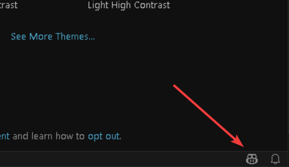
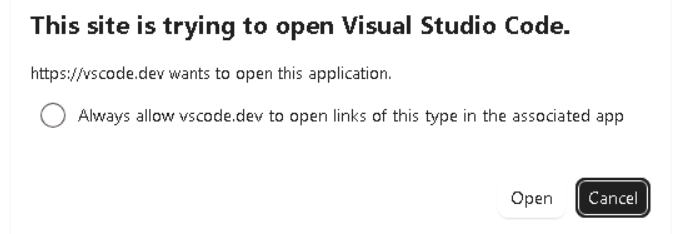
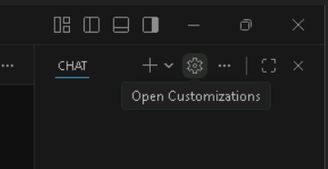
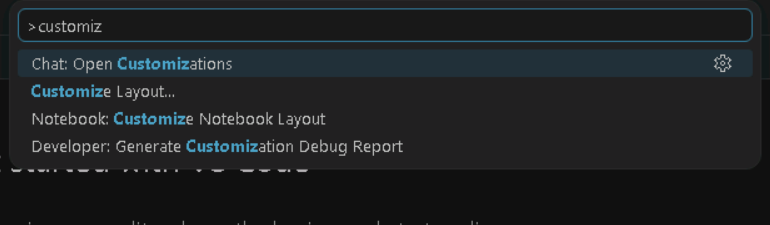
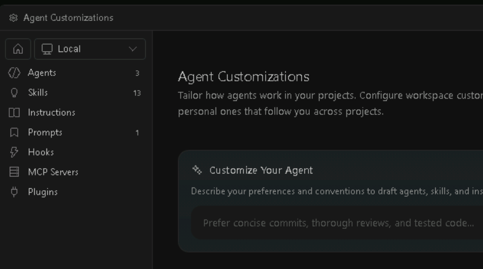
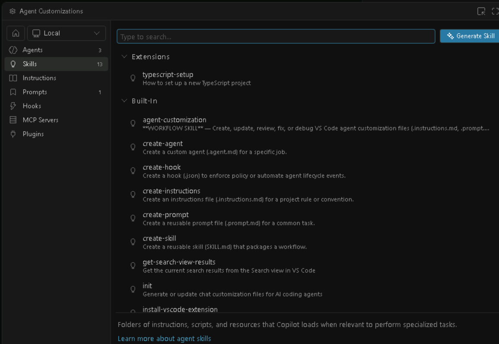

# Exploring Copilot customizations

So far you've used a plugin that someone else built. Behind that plugin is a small ecosystem of **customization primitives** that VS Code Copilot exposes to anyone - you can mix and match them to shape how Copilot behaves in your own projects, with or without packaging them as a plugin.

In this short module you will open the **Agent Customizations** view in Visual Studio Code, see the different types of customizations at a glance, and inspect the Markdown definition of one built-in skill.

## The customization primitives

VS Code Copilot ships with a small set of customization building blocks. Each one solves a different problem:

- **Custom instructions** - Markdown files that act as always-on (or path-scoped) "house rules" for the AI. Best for **project-wide standards** like coding style, architecture, or constraints. (You'll create one in the next module.)
- **Prompt files** - Reusable Markdown prompts that show up as **slash commands** in chat. They are useful to recognize if you encounter them, but new reusable workflows should usually be built as skills since prompts need to be invoked explicitly and don't support bundled assets. (You'll create one in the reusable prompt bonus module.)
- **Skills** - folders containing a **SKILL.md** file plus optional scripts, templates, and resources. They package a **multi-step workflow** the agent can discover from the skill description, or that a user can invoke explicitly as a slash command (you saw **share-screenshot** in module "Sharing a screenshot with the community").
- **Custom agents** - **.agent.md** files defining a **specialized persona** with its own tool allow-list, MCP servers, and skills. Tools can be restricted so the agent only has access to the capabilities it needs (you saw **web-screenshotter** in module "Sharing a screenshot with the community").
- **MCP servers** - Model Context Protocol servers that connect Copilot to **external tools and data sources** (databases, APIs, browsers, …).
- **Hooks** - shell commands that run at specific **agent lifecycle events** (after a file edit, after a tool call, …) for deterministic outcomes like formatting, linting, or telemetry.
- **Plugins** - pre-packaged bundles of all of the above, distributed through marketplaces. The **space-invaders-makers-community** plugin you installed in module "Installing the community plugin" is exactly this.

> [!NOTE]
> Customizations have a **scope**: they can be **personal** (follow you across every workspace), **workspace** (live in the repo and apply to everyone working in it).

## Scenario

In this exercise you will open Visual Studio Code, sign in to GitHub Copilot, open the **Agent Customizations** view, browse the different customization types, and read the Markdown definition of a built-in skill of your choice.

### Open Visual Studio Code and authenticate to GitHub Copilot

1. [] Open **Visual Studio Code** (it is pinned on the taskbar).
2. [] Click the Copilot icon in the bottom-right corner of the Visual Studio Code status bar, then click **Use AI Features**.

	

3. [] Click **Continue with GitHub** in the **Sign in to use AI Features** dialog. A browser window will open to complete the authentication flow.
4. [] Since you are already authenticated in the browser, click the **Continue** green button on the **Authorize Visual Studio Code** page.
5. [] Scroll down on the **Authorize Visual Studio Code** page and click the **Authorize Visual-Studio-Code** green button to grant permissions.
6. [] A popup will appear: **This site is trying to open Visual Studio Code.** Click the **Open** button.

	

7. [] Open the **Copilot Chat** view if it isn't already visible (click **Toggle Chat** in the Activity Bar, or press <kbd>Ctrl</kbd>+<kbd>Alt</kbd>+<kbd>I</kbd>).

> [!NOTE]
> The **sessions list** in the Chat view gives you a unified view of all your Copilot conversations, regardless of where they started. Sessions are shared across surfaces, so the CLI session you created earlier (Copilot names sessions automatically, for example "invaders") appears right alongside any Visual Studio Code or Cloud Agent sessions.
> Select that session to review the full CLI conversation - you can then continue it directly from Visual Studio Code by typing a new message or running slash commands.
> You can also **resume** a previous CLI session with **copilot --continue** (most recent) or **copilot --resume=SESSION_ID**, and even **steer a running session remotely** from GitHub.com or GitHub Mobile by enabling remote access with **copilot --remote** or the **/remote** slash command.

### Inspect the available customizations

Now let's inspect the available customizations and look at one of the built-in skills to see how it is defined.

8. [] Open the **Agent Customizations** view. There are two equivalent ways:

	- Click the **gear** ⚙ icon in the Copilot Chat title bar and choose **Open Customizations**.

		

	- Or open the **Command Palette** (<kbd>Ctrl</kbd>+<kbd>Shift</kbd>+<kbd>P</kbd>) and run **Chat: Open Customizations**.

		

9. [] Take a moment to look at the left-hand navigation. You should see one entry per customization type - **Agents**, **Skills**, **Instructions**, **Prompts**, **Hooks**, **MCP Servers**, and **Plugins** - with a count next to each one showing how many are currently available.

	

10. [] Click **Skills** in the left navigation. You will see skills grouped by source - for example **Extensions** (contributed by installed extensions) and **Built-In** (shipped with Visual Studio Code).

	

11. [] Pick **any built-in skill** from the list that catches your attention (for example **create-instructions**, which you will use later) and click it.

12. [] Visual Studio Code will open the skill's **SKILL.md** file. Read through it and notice:

	- The **YAML front matter** at the top with a **name** and a **description** - this is what Copilot matches against when deciding whether the skill is relevant to your prompt.
	- The **Markdown body** below the front matter - these are the natural-language instructions the agent will follow when the skill is invoked. There is **no special DSL**: it is just structured prose telling the agent what to do, step by step.

	That is the entire contract. A skill is just a folder with a **SKILL.md** file (and optionally helper scripts). The same shape works for skills you write yourself, skills shipped with Visual Studio Code, and skills delivered by a plugin like the one you installed earlier.

## Summary and Next Steps

You opened the Agent Customizations view, saw the customization types Copilot exposes (**instructions**, **prompts**, **skills**, **agents**, **MCP servers**, **hooks**, and **plugins**), and inspected the Markdown definition of a built-in skill. You now have a mental map of where each primitive fits and how simply many of them are defined: plain Markdown with a bit of front matter.

In the next module you will put one of these primitives to work in your own project: you'll generate a **repository custom instructions** file so every future Copilot session in this workspace starts with the right context about the Space Invaders game.

[← Previous: Screenshot sharing](04-screenshot-sharing.md) | [Next: Creating instructions →](06-creating-instructions.md)

## Resources

- [Visual Studio Code: Copilot customization overview][vscode-customization]
- [Agent Config: AI assistant customization primitives][agentconfig]
- [Visual Studio Code: Custom instructions][vscode-instructions]
- [Visual Studio Code: Prompt files][vscode-prompts]
- [Visual Studio Code: Skills][vscode-skills]
- [GitHub CLI: gh skill][gh-skill]
- [Visual Studio Code: Custom agents][vscode-agents]
- [Visual Studio Code: MCP servers][vscode-mcp]
- [Visual Studio Code: Hooks][vscode-hooks]
- [Visual Studio Code: Plugins][vscode-plugins]

[vscode-customization]: https://code.visualstudio.com/docs/copilot/concepts/customization
[agentconfig]: https://agentconfig.org/
[vscode-instructions]: https://code.visualstudio.com/docs/copilot/customization/custom-instructions
[vscode-prompts]: https://code.visualstudio.com/docs/copilot/customization/prompt-files
[vscode-skills]: https://code.visualstudio.com/docs/copilot/customization/agent-skills
[gh-skill]: https://cli.github.com/manual/gh_skill
[vscode-agents]: https://code.visualstudio.com/docs/copilot/customization/custom-agents
[vscode-mcp]: https://code.visualstudio.com/docs/copilot/customization/mcp-servers
[vscode-hooks]: https://code.visualstudio.com/docs/copilot/customization/hooks
[vscode-plugins]: https://code.visualstudio.com/docs/copilot/customization/agent-plugins