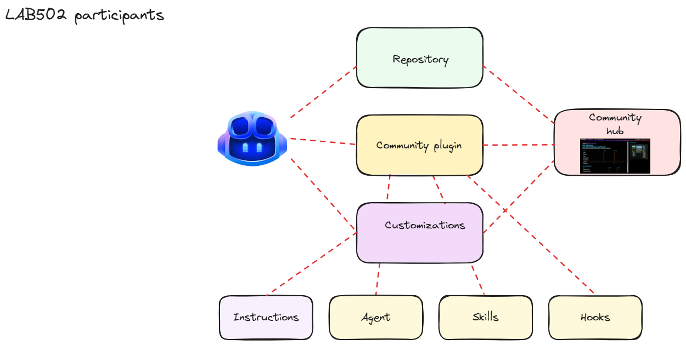
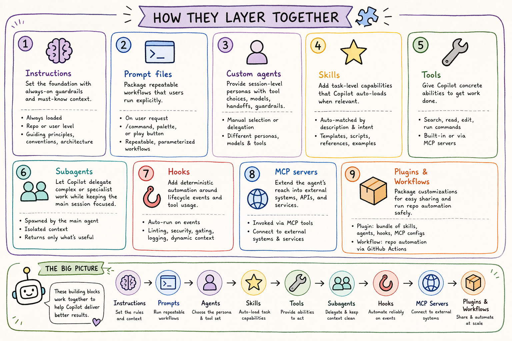
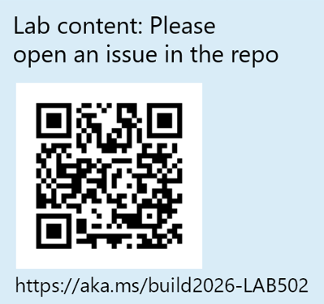

# Lab recap

Congratulations - you made it through the lab! In a single session you went from an empty workspace to a working Space Invaders game, shared a screenshot through a community plugin, and built up your own set of GitHub Copilot customizations on top.

> [!TIP]
> Browse all the games built by other attendees in the **Invaders Gallery** at https://bld26lab502.azurewebsites.net/gallery.

## What you did

- **Set up the environment** - initialized Git repo and signed in to the GitHub Copilot CLI.
- **Installed a community plugin** - added the **space-invaders-makers** plugin and saw how a single package can ship skills, agents, hooks, and more.
- **Generated the game** - used Copilot's **plan mode** to design the game, then let the agent build a self-contained Space Invaders-inspired HTML game.
- **Shared a screenshot** - delegated the full capture-and-publish flow to the plugin's **web-screenshotter** custom agent and **share-screenshot** skill.
- **Toured the customization view** - opened **Agent Customizations** in Visual Studio Code, observed different customization types, and inspected the Markdown definition of a built-in skill.
- **Wrote repository instructions** - generated a **.github/copilot-instructions.md** so every future session in the repo starts with the right context.
- **Created an agent skill** - Turned a multi-step workflow into a **SKILL.md** to upload games to the Lab 502 Community Hub.
  - **Shared the game** - Shared the game with the community using the created skill.

## Customization types at a glance

Each primitive plays a different role in shaping how Copilot behaves. The Copilot customization landscape includes instructions, prompt files, custom agents, skills, MCP servers, hooks, plugins, and agentic workflows. Use this table as a quick reference for **when each one activates**, **what it is best suited for**, and **how it is invoked**:

| Type | Activation | Invocation | Best for | Lives in |
| --- | --- | --- | --- | --- |
| **Custom instructions** (**copilot-instructions.md**, **AGENTS.md**) | Loaded on every session for the repo or user | Automatic - always-on context | Repo-wide guardrails, conventions, architecture decisions, "must-know" facts every session needs | Repo: **.github/copilot-instructions.md** or **AGENTS.md**; personal: user-level instruction files |
| **File-based instructions** (***.instructions.md**) | When the current context matches the **applyTo** glob | Automatic - passive, scoped context | Area-specific rules: language standards, framework patterns, test conventions, security guardrails | Repo/workspace: anywhere in the workspace, commonly **.github/instructions/**; personal: user-level instruction files |
| **Prompt files** (***.prompt.md**) | On user request via **/command**, Command Palette, or the editor play button | Manual - explicit invocation | Repeatable, parameterized workflows with optional tool, model, and agent settings | Repo: **.github/prompts/**; personal: user-level prompts folder |
| **Skills** (**SKILL.md** + bundled assets) | Auto-matched by Copilot from the skill **description** when relevant to the task | Automatic by agent intent matching | Portable, task-level capabilities that bundle templates, scripts, references, and examples | Repo: **.github/skills/<name>/SKILL.md**; personal: **~/.copilot/skills/<name>/SKILL.md** |
| **Tools** | When Copilot needs an ability to perform a task | Usually automatic, with user and/or hooks allow/deny controls | Searching, reading files, editing, running commands, invoking skills, using MCP-provided capabilities | Built in or supplied by MCP servers |
| **Subagents** | When Copilot delegates part of a task to a separate agent process with its own fresh context | Automatic when Copilot decides delegation is useful or user/agent explicitly states it | Isolating focused work, keeping the main context clean, reducing distraction from long tool traces, parallelizing exploration or validation, and bringing back only the useful result | Spawned by the main agent |
| **Custom agents** (***.agent.md**) | When selected in chat or used as a handoff/delegation target | Manual selection or delegation | Session-level personas with their own tools, model, handoffs, and guardrails for complex workflows | Repo: **.github/agents/**; personal: user-level agents folder |
| **Hooks** (***.json**) | On a lifecycle event (**SessionStart**, **UserPromptSubmit**, **PreToolUse**, **PostToolUse**, …) | Automatic - deterministic, runs outside the model | Things you don't want the AI to "remember" to do: linting, formatting, security gating, audit logging. Can also **inject context** into the conversation (via `additionalContext`) and **reject or modify tool calls** (via `permissionDecision: "deny"` or exit code `2`) to block or steer agent behavior | Repo: **.github/hooks/*.json**; personal: **~/.copilot/hooks** |
| **MCP servers** | When configured; their tools are surfaced to Copilot Chat | Invoked via MCP tools when needed | External gateways: databases, APIs, GitHub, internal services - anything you want the agent to query or act on | Repo/workspace: **.vscode/mcp.json**; personal: user-level **mcp.json** or **~/.copilot/mcp-config.json** |
| **Plugins** | Installed as a unit; their pieces follow each type's rules above | Bundled distribution | Sharing a curated bundle of skills, custom agents, hooks, MCP server configurations, and LSP server configurations | Plugin folder with **plugin.json**, usually installed from a marketplace, repository, or local path |
| **Agentic workflows** (***.md**) | On GitHub Actions triggers such as issues, PRs, comments, schedules, or **workflow_dispatch** | Automatic repository automation | AI-powered repository automation with strong guardrails, sandboxing, and safe outputs | Repo: **.github/workflows/*.md** compiled to a locked workflow |

### Picking the right tool

A quick decision guide when you're unsure which primitive to reach for:

- **"Copilot should always know this about our codebase."** → Custom instructions.
- **"This rule only applies to TypeScript / tests / a specific folder."** → File-based instructions with **applyTo**.
- **"I want a /command I can run on demand."** → Prompt file for a simple reusable prompt, or a skill if the workflow has multiple steps, scripts, references, or assets.
- **"The agent should figure out *when* to apply this workflow."** → Skill - write a strong, keyword-rich **description** so the agent can discover it.
- **"Copilot needs to search, edit, run commands, or use an external capability."** → Tool - Copilot requests permission and uses the right tool for the task.
- **"Copilot needs current facts or actions from another system."** → MCP server - expose external tools, resources, or prompts through a standard interface.
- **"This task is large enough that part of the work should happen separately."** → Subagent - Copilot delegates automatically when it helps keep the main context focused.
- **"I need a different persona, model, or tool set for this kind of work."** → Custom agent.
- **"This must run reliably every time, even if the model forgets."** → Hook.
- **"I need evidence that the output is correct."** → Verification/evals - tests, linting, type checking, static analysis, or review.
- **"I want to ship a bundle of customizations as a single installable package."** → Plugin.

### How they layer together

These primitives are **complementary**, not competing:

1. **Instructions** lay the groundwork with always-on guardrails.
2. **Prompt files** package repeatable workflows that a user runs explicitly.
3. **Custom agents** provide opinionated session-level personas with tool choices, model choices, handoffs, and guardrails.
4. **Skills** add task-level capabilities that Copilot can auto-load when their descriptions match the request.
5. **Tools** give Copilot concrete abilities, from reading files to running commands and using MCP-provided actions.
6. **Subagents** let Copilot delegate complex or specialist work while keeping the main session focused.
7. **Hooks** add deterministic automation around the model's actions — they can also inject context into the conversation (e.g. environment info at `SessionStart`) or reject individual tool calls (via `permissionDecision: "deny"` in `PreToolUse`) to block or steer agent behavior without relying on the model.
8. **MCP servers** extend the agent's reach into external systems.
9. **Plugins** package customizations for easy sharing and updates.

> [!NOTE]
> The lab's plugin hooks and Community Hub give you a small, purpose-built telemetry loop. For a production observability pattern, see [Monitor AI coding agents with Grafana](https://learn.microsoft.com/en-us/azure/managed-grafana/grafana-opentelemetry-app-insights), which shows how to collect OpenTelemetry from AI coding agents and visualize usage, latency, errors, model activity, and tool calls with Application Insights and Grafana.

## Bonus modules

If you have extra time, continue with the bonus modules, pick and choose based on your interests:

1. **Copilot cloud agent** - push your project to GitHub and assign a repository task to the cloud agent.
2. **Using an MCP server** - connect the Lab 502 Community Hub as a remote MCP server and use its tools directly from Visual Studio Code.
3. **Creating a reusable prompt** - create a workspace prompt file as an on-demand slash command.

## Thank you

Please leave feedback for the [lab experience](https://aka.ms/build2026-feedback)

If you encountered any issues during this lab or would like to try it self-paced, see the [lab repo](https://aka.ms/build2026-LAB502) and open an issue.

[← Previous: Creating a skill](07-creating-a-skill.md) | [Bonus 1: Copilot cloud agent →](bonus-01-copilot-cloud-agent.md) | [Bonus 2: Using an MCP server →](bonus-02-using-an-mcp-server.md) | [Bonus 3: Creating a reusable prompt →](bonus-03-creating-a-reusable-prompt.md)

## Resources

- [What are Agents, Skills, and Instructions][agents-skills-instructions]
- [GitHub CLI: gh skill][gh-skill]
- [Copilot configuration basics][copilot-configuration-basics]
- [Agentic workflows][agentic-workflows]
- [Microsoft AgentRC][agentrc]
- [Awesome GitHub Copilot][awesome-copilot]
- [How to use hooks in the GitHub Copilot CLI][yt-copilot-hooks]
- [Monitor AI coding agents with Grafana](https://learn.microsoft.com/en-us/azure/managed-grafana/grafana-opentelemetry-app-insights)
- [Stop treating your AI like a toy][stop-treating-your-ai-like-a-toy]
- [Tutorials for GitHub Copilot][tutorials-for-copilot]

[agents-skills-instructions]: https://awesome-copilot.github.com/learning-hub/what-are-agents-skills-instructions/
[gh-skill]: https://cli.github.com/manual/gh_skill
[copilot-configuration-basics]: https://awesome-copilot.github.com/learning-hub/copilot-configuration-basics/
[agentic-workflows]: https://awesome-copilot.github.com/learning-hub/agentic-workflows/
[agentrc]: https://github.com/microsoft/agentrc
[awesome-copilot]: https://github.com/github/awesome-copilot
[yt-copilot-hooks]: https://www.youtube.com/watch?v=bglVc9HDfwg
[stop-treating-your-ai-like-a-toy]: https://github.com/resources/insights/ai-infrastructure-design
[monitor-ai-coding-agents-with-grafana]: https://learn.microsoft.com/en-us/azure/managed-grafana/grafana-opentelemetry-app-insights
[tutorials-for-copilot]: https://docs.github.com/en/copilot/tutorials