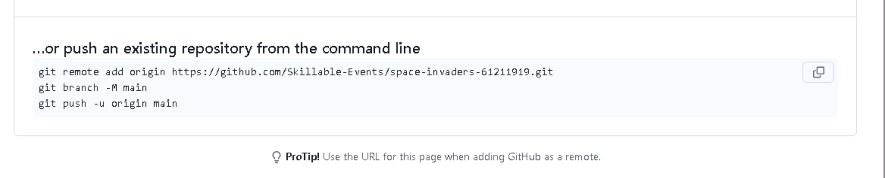

# Bonus 1: Copilot cloud agent

Throughout this lab you created Copilot customizations — instructions, custom agents, and agent skills — and used them locally from the CLI and Visual Studio Code. Those same repository customization files also work with the **Copilot cloud agent**: the GitHub-hosted agent that can work independently in the background to research a repository, create an implementation plan, make changes on a branch, and either hand the work back for iteration or open a pull request.

In this bonus exercise you will push your project to GitHub, assign an issue to Copilot, and watch it open a PR that respects the rules you already wrote — proving that customizations carry across **all** Copilot surfaces.

## What is the Copilot cloud agent?

The Copilot cloud agent is an AI-powered developer that runs in a secure, cloud-hosted environment and can take on development tasks in the background. Depending on how you start the task, it can research the repository, propose a plan, make changes on a branch, run checks, and let you review or iterate before a pull request is created.

In this exercise, you will use the issue-based workflow. You assign Copilot a GitHub issue, and it:

- Reads the issue description and any linked context.
- Clones the repository and checks out a branch.
- Plans and implements the changes autonomously — reading files, writing code, running commands.
- Opens a pull request with the result.

Because it works directly in the repository, it picks up the same **.github/copilot-instructions.md** file that your local Copilot sessions use. It can also discover skills in **.github/skills/**, though for this exercise the main thing you will see in action is the **instructions file**. **Write once, apply everywhere.**

> [!NOTE]
> The Copilot cloud agent runs in a GitHub-hosted environment powered by GitHub Actions. It has access to standard tools like **git**, **node**, **curl**, and anything you configure via a **copilot-setup-steps.yml** workflow (not used in this exercise). It does **not** have access to your local machine, Visual Studio Code extensions, or locally installed MCP servers — only the customization files committed to the repository.

## Scenario

You will push your Space Invaders project to a GitHub repository, create an issue asking for a small feature improvement, and assign it to Copilot. When the pull request arrives, you will verify that Copilot respected the instructions you authored earlier.

### Create a repository and push your code

1.  Open **Edge** and navigate to `https://github.com/organizations/Skillable-Events/repositories/new` to create a new repository.

2.  Fill in the repository details:
	- **Owner**: Make sure **Skillable-Events** is selected (it should be the default).
	- **Repository name**: Choose something unique — for example, `space-invaders-<your-alias>` (replace **<your-alias>** with your alias or initial. Take note of the name you have chosen).
	- Leave everything else as default.
3.  Click the **Create repository** button.

4.  Switch to Visual Studio Code

5.  Open the **Source control** panel by clicking on the Git icon in the left sidebar.
6.  You should see all your files listed as uncommitted changes. Click the **+** icon at the top of the panel to stage all changes for commit.
7.  Hover over the files you want to push (**index.html** and the **.github/** folder, including **.github/skills/**) and click the **+** icon that appears to stage them for commit. There may be other files you don't care about in the **.playwright-mcp** folder. Don't stage those or delete them.

8.  Enter a commit message in the **Message** box, for example, `Initial commit` or click on the stars icon to generate a commit message using Copilot.

9.  Click the **Commit** button.


10.  Switch back to the browser tab where you created the repository. In the quick setup view, click the copy-to-clipboard icon next to the "... or push an existing repository from the command line" section to copy the Git commands needed to push your code.



11.  Open a terminal and change to the space invaders directory if not already there (`c:\users\labuser\invaders`), then paste and run the commands you just copied to push your code to GitHub. The commands should look like this (notice the repo name is not correct in the example below):

```ps1-notype-nocopy-
git remote add origin https://github.com/Skillable-Events/space-invaders-XXXXXXXXX.git
git branch -M main
git push -u origin main
```

12.  Click on **Sign in with your browser** when prompted to authenticate with GitHub and complete the authentication flow in the browser.

13.  Switch back to the browser tab where you created the repository and refresh the page (or navigate to the repository again if you closed it). You should now see the files you just pushed, including **.github/copilot-instructions.md** and the **skills/** folder with your custom agent skills.

Your code is now on the GitHub repository you just created.

### Assign a task to the Copilot cloud agent

You can delegate the next task to Copilot cloud agent in two ways. Use **Option A** to create a GitHub issue and assign it to Copilot from github.com, which shows the issue-based workflow most teams use for backlog work. Use **Option B** to delegate the same task from **Copilot Chat** in Visual Studio Code (without an issue), which starts a cloud agent session directly from your editor.

#### Option A: Create the issue from github.com

1.  Open the browser and if not already on the repo open the repository. You should see the files you just pushed from Visual Studio Code.

2.  In your repository on GitHub, click the **Issues** tab, then click **New issue** green button.

3.  Fill in the issue:
	- **Title**: `Add persistent high score tracking`
	- **Body**:
	```
	Track the player's highest score using localStorage and display it in the game's HUD (heads-up display) alongside the current score. When the player beats their high score, update it and show a brief celebration message.

	Keep all changes in the existing single HTML file — do not create additional files or add external dependencies.
	```

4.  Before clicking **Submit new issue**, click the **Assignees** gear icon in the right sidebar and select **Copilot** from the dropdown. A dialog will appear asking you to confirm the repository and branch. Accept the defaults by clicking the **Assign** green button. You could select a specific model or an agent with specific skills here, but for this exercise, use the defaults.

> [!TIP]
> Notice how the issue body reinforces the single-file constraint from `copilot-instructions.md`. This is intentional — it gives the agent clear acceptance criteria **and** the instructions file provides the same guardrail as always-on context. Belt and suspenders.

5.  Click **Create** green button to create the issue (scroll down if necessary).

6.  Once the issue is created, the cloud agent starts working. You will notice an **eyes** emoji reaction on the issue; this is Copilot acknowledging that it has seen the issue. After a few moments, the agent will open a pull request with the implementation.

7.  Click on the pull request link to review the changes or click on the **Agents** tab to see the agent's activity feed, where you can watch the agent's progress in real time.

8.  Click on the **View session** if you clicked on the pull request, or on the session name (the agent decides the name, but it could be something like "Implementing persistent high score tracking for the game") if you clicked on the **Agents** tab, to see the step-by-step actions taken by the agent.

9.  Navigate at will to watch the decisions and operations being performed by the Copilot cloud agent.

10.  Once the agent finishes, you will see a **View pull request** green button at the bottom of the screen. Click it and review the pull request to verify that the changes respect the constraints you set in the instructions file and issue description.

11.  Inspect the pull request body, this will have a summary of the changes made by the agent.

12.  Review the code changes by clicking on "Files changed" tab.

13.  You can ask Copilot questions about this diff by clicking the Copilot button.

14.  If you want Copilot to make changes, go to the **Conversation** tab and mention **@copilot** in a comment with the changes you want.


> [!NOTE]
> **You've already succeeded** once the agent starts working on the issue. The PR may take a few minutes to appear — if the lab is wrapping up, don't worry. The key takeaway is that the cloud agent picked up your customizations from the repository.

#### Option B: Create a task from Visual Studio Code

1.  Switch to Visual Studio Code and open the **Copilot Chat** view.

2.  At the bottom of the chat, click on the dropdown that says **Local** and select **Cloud**. This switches the context of the chat to the Copilot cloud agent.

3.  Enter the following prompt in the chat input box. Use the copy button, then paste the prompt:

```text-notype
Track the player's highest score using localStorage and display it in the game's HUD (heads-up display) alongside the current score. When the player beats their high score, update it and show a brief celebration message.

Keep all changes in the existing single HTML file — do not create additional files or add external dependencies.
```

4.  Submit the prompt and click **Delegate** when Copilot asks for your confirmation.

5.  Once cloud agent starts working, you can observe the progress in the **Copilot Chat** view, where the agent will provide updates on its actions and decisions as it works on the task.

> [!NOTE]
> You can see everything happening from Visual Studio Code because sessions, whether local or cloud, are visible and interactive from any Visual Studio Code instance that has access to the repository. In a real workflow, you might delegate the task and move on to other work. In this lab, let's observe the changes being made in GitHub.com.

6.  Switch to the browser and navigate to the repository you created on GitHub.

7.  Click the **Agents** tab. You should see the session you created from Visual Studio Code, including the name of the task it is working on (for example, "Implementing persistent high score tracking for the game"). Click it to see the step-by-step actions taken by the agent.

8.  Navigate at will to watch the decisions and operations being performed by the Copilot cloud agent.

9.  You are able to steer the agent by giving it new instructions in the **Conversation** tab. For example, you could ask it to "Make sure to update the celebration message to also include confetti animation"

10.  Once the agent finishes, you will see a **View pull request** green button at the bottom of the screen. Click it and review the pull request to verify that the changes respect the constraints you set in the instructions file and issue description.

11.  Open the pull request. You can find it from the issue page (Copilot links it automatically) or from the **Pull requests** tab in your repository.

12.  Review the changes in the PR and check that the Copilot cloud agent respected your customizations:

- **Single file**: All changes are in the existing HTML file — no new files were created.
- **No external dependencies**: No CDN links, npm packages, or external assets were added.
- **Feature works**: The high score is stored in `localStorage` and displayed in the HUD.


> [!NOTE]
> This option is a more direct way to assign a task to the cloud agent without leaving Visual Studio Code.


### What just happened

By pushing your `.github/copilot-instructions.md` to the repository, every Copilot surface — CLI, Visual Studio Code, Visual Studio, other IDEs, and the cloud agent — now shares the same project context. After you assigned a task to it, the cloud agent:

- Read your **copilot-instructions.md** and respected the single-file, no-external-dependencies constraint.
- Had access to any **agent skills** in `.github/skills/`, though they weren't needed for this particular task.

This is the key takeaway: **customizations are not tied to a single tool or editor**. They live in the repository, travel with the code, and apply everywhere Copilot operates.

## Summary

You pushed your Space Invaders project to GitHub, created a well-defined issue, and assigned it to the Copilot cloud agent. The agent then autonomously implements the feature and opens a pull request — all while respecting the instructions and constraints you authored earlier in the lab. This closes the loop: the customizations you build for local development apply equally to automated, cloud-based workflows.

If you are continuing through the bonus modules, the next exercise switches back to Visual Studio Code and connects the Lab 502 Community Hub as a remote MCP server so you can use its tools directly from Copilot Chat.

<div class="invis">[← Previous: Recap](08-recap.md) | [Next: Using an MCP server (bonus) →](bonus-02-using-an-mcp-server.md)</div>

## Resources

- [About the Copilot cloud agent][copilot-cloud-agent]
- [Using the Copilot cloud agent][using-cloud-agent]
- [Best practices for using the Copilot cloud agent][cloud-agent-best-practices]
- [GitHub MCP Server][github-mcp-server]
- [Comparing Copilot CLI features][comparing-cli-features]

[comparing-cli-features]: https://docs.github.com/en/copilot/concepts/agents/copilot-cli/comparing-cli-features
[copilot-cloud-agent]: https://docs.github.com/en/copilot/concepts/agents/cloud-agent/about-cloud-agent
[using-cloud-agent]: https://docs.github.com/en/copilot/how-tos/using-copilot-cloud-agent
[cloud-agent-best-practices]: https://docs.github.com/en/copilot/how-tos/using-copilot-cloud-agent/best-practices-for-using-copilot-cloud-agent
[github-mcp-server]: https://github.com/github/github-mcp-server
