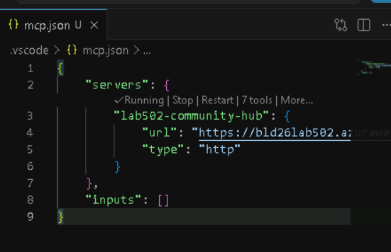
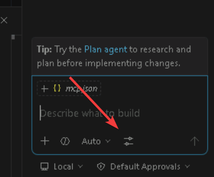
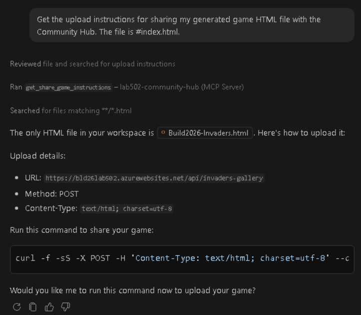

# Bonus 2: Using an MCP server

In the main lab you used a plugin that quietly brought extra capabilities into Copilot: a custom agent, a skill, hooks, and a Playwright MCP server. In this bonus module you will connect to an MCP server directly from Visual Studio Code, inspect the tools it exposes, and use those tools to interact with the Lab 502 Community Hub.

## MCP servers

The **Model Context Protocol** (MCP) is a standard way for AI applications to connect to external tools and data sources. Instead of every agent integration inventing its own format, an MCP server can publish **tools** (actions the agent can call), **resources** (context the agent can read), and **prompts** (reusable interaction templates). Copilot can then use those capabilities when your prompt requires them.

MCP is useful when the agent needs to reach outside the current workspace:

- **Data access**: read data from a system such as a database, issue tracker, dashboard, or internal API.
- **Actions**: perform controlled operations such as uploading a file, creating a record, or triggering a workflow.
- **Discovery**: let Copilot inspect what the server can do instead of requiring you to memorize API endpoints or request schemas.
- **Separation of concerns**: keep the API logic inside the server while the agent focuses on intent, orchestration, and explanation.

For this exercise, the Lab 502 Community Hub exposes a remote MCP server at:

`https://bld26lab502.azurewebsites.net/mcp`

> [!NOTE]
> The full source code of the MCP server is available at https://github.com/microsoft/Build26-LAB502-make-github-copilot-work-your-way-custom-tools-context-and-workflows/tree/main/src/plugins/community-hub

The server gives Copilot controlled access to community-hub operations such as listing shared games and screenshots, checking activity, and retrieving upload instructions for sharing game artifacts.

## Scenario

In this exercise you will install the remote Lab 502 MCP server in Visual Studio Code, confirm that Copilot can see its tools, and try a few prompts that use the Community Hub without calling the REST API manually.

### Install the MCP server

1. [] Switch to **Visual Studio Code**.
2. [] Open the **Command Palette** (<kbd>Ctrl</kbd>+<kbd>Shift</kbd>+<kbd>P</kbd>).
  - You can also use the **Agent Customizations** view to manage MCP servers, but the Command Palette is the most direct way to add a new one.
3. [] Run **MCP: Add Server**.
4. [] Choose **HTTP**.
5. [] Paste the remote MCP server URL: `https://bld26lab502.azurewebsites.net/mcp`
6. [] Name the server: `lab502-community-hub`
7. [] Choose where to save it. **Global** is the easiest option for this lab because the server follows you across workspaces. **Workspace** is better if you want everyone opening the repo to get the same MCP server configuration.

You should now have a **mcp.json** file (opened in Visual Studio Code), with content similar to this:

```json-notype-nocopy
{
    "servers": {
        "lab502-community-hub": {
            "url": "https://bld26lab502.azurewebsites.net/mcp",
            "type": "http"
        }
    },
    "inputs": []
}
```

You can also hover over **lab502-community-hub** and see a status such as **Running | Stop | Restart | 7 tools | More...** before the server name. This confirms that Visual Studio Code can connect to the server and retrieve the tool definitions.




> [!TIP]
> If you prefer editing configuration directly, open **Agent Customizations**, choose **MCP Servers**, and add a remote HTTP server with the same URL. The resulting configuration is usually a small JSON entry with a server name and a **url** value.

### Confirm the server is connected

8. [] Open the **Agent Customizations** view:

	- Click the **gear** icon in the Copilot Chat title bar and choose **Open Customizations**.
	- Or open the **Command Palette** and run **Chat: Open Customizations**.

9. [] Click **MCP Servers** in the left navigation.
10. [] Find **lab502-community-hub** and confirm it is configured and running.
11. [] Close the **Agent Customizations** view.
12. [] Open Copilot Chat.
13. [] Click **Configure tools** at the bottom of the prompt input text box. The icon looks like two small horizontal sliders and sits just to the right of the model dropdown.
   
14. [] Look for tools from the **lab502-community-hub** family and expand it

You should see tools in this family:

- **get_community_activity**: inspect recent community activity across the hub.
- **list_tenants**: list known tenants and see the current tenant.
- **list_games**: list uploaded Space Invaders games and their URLs.
- **list_screenshots**: list uploaded screenshot URLs.
- **get_screenshot_upload_instructions**: get the upload instructions for a screenshot file.
- **get_share_game_instructions**: get the upload instructions for a single-file HTML game.
- **list_tool_usage**: inspect per-tool usage counts for the current tenant.

> [!NOTE]
> Tool names may appear with a server prefix or slightly different display formatting in Visual Studio Code. Focus on the descriptions: they tell you what each tool does and what inputs it expects.

### Try the MCP tools from chat

Now use Copilot Chat in **Agent** mode and ask questions that naturally require the Community Hub tools. You do not need to mention tool names unless you want to (for example you can use **#list_games** to explicitly invoke the list games tool). Copilot should select the relevant MCP tool based on your request.

Try a few of these prompts:

> [!TIP]
> You may want to enable autopilot to avoid having to confirm each tool call.
> When a tool is executed, you can expand the tool call in the chat history to see the exact inputs and outputs, which can be helpful for understanding how to use the tools in your own prompts.

#### List tools

```text
What Lab 502 Community Hub tools are available from the MCP server? Summarize what each one is for.
```

#### List games

```text
List the latest Space Invaders games shared in the Community Hub and give me their URLs.
```

#### List screenshots

```text
Show me the screenshots that have been shared to the Community Hub.
```

#### Check activity

```text
Check recent Community Hub activity and summarize what participants have been doing.
```

#### Tool usage

```text
Which MCP tools have been used the most in this tenant? Describe what those tools do as well.
```

#### Share a game

```text
Get the upload instructions for sharing my generated game HTML file with the Community Hub. The file is #index.html.
```

This prompt is interesting because it shows how to save context by avoiding sending the full file content into chat. Instead, it gives Copilot the file reference and asks it to use the MCP upload instructions, so the file is uploaded directly rather than copied into the prompt context.



> [!IMPORTANT]
> This prompt is about understanding the upload flow for MCP tools. In a real workflow, you would simply ask Copilot to upload the file; Copilot would fetch the upload instructions from the MCP server, then follow them to upload the file, similar to the way the skill handled uploads earlier in the lab.

### Compare MCP with the plugin workflow

You have now seen two ways of connecting Copilot to external capabilities:

- The **plugin workflow** from the main lab gave you a ready-made experience: a custom agent and skill wrapped the details so you could say "take a screenshot and share it".
- The **direct MCP workflow** in this bonus module exposes the Community Hub tools directly to Visual Studio Code, which is useful when you want to inspect data, ask ad hoc questions, or build your own workflow on top of the tools.

Neither approach replaces the other. Plugins are great for packaged, opinionated workflows. MCP servers are great for making external capabilities available to agents in a standard, discoverable way. MCP also gives hosts and servers a standardized way to handle authentication and authorization, which is harder to get right with skills because each skill usually has to invent its own credential flow, token storage, and error handling. In practice, the strongest customizations often combine both: an agent or skill provides the workflow, and an MCP server provides the tools.

## Summary

You installed the remote Lab 502 Community Hub MCP server in Visual Studio Code, inspected the tools it exposes, and used natural-language prompts to query shared games, screenshots, activity, tool usage, and upload instructions. You also saw how MCP fits with the rest of Copilot's customization model: it gives agents a standard way to reach external systems without hard-coding API calls into every prompt or skill.

If you are continuing through the bonus modules, the next exercise creates a reusable prompt file. That is intentionally last: after seeing instructions, skills, agents, hooks, plugins, cloud agent, and MCP servers, you can place prompt files in context as an on-demand workflow primitive.

<div class="invis">[← Previous: Copilot cloud agent (bonus)](bonus-01-copilot-cloud-agent.md) | [Next: Creating a reusable prompt (bonus) →](bonus-03-creating-a-reusable-prompt.md)</div>

## Resources

- [Visual Studio Code: MCP servers][vscode-mcp]
- [Visual Studio Code: Use tools with agents][vscode-tools-with-agents]
- [Model Context Protocol documentation][mcp-docs]
- [GitHub Docs: Extending Copilot Chat with MCP][github-copilot-mcp]
- [Visual Studio Code: Agent mode][vscode-agent-mode]


[vscode-tools-with-agents]: https://code.visualstudio.com/docs/copilot/agents/agent-tools
[vscode-mcp]: https://code.visualstudio.com/docs/copilot/customization/mcp-servers
[mcp-docs]: https://modelcontextprotocol.io/
[github-copilot-mcp]: https://docs.github.com/en/copilot/customizing-copilot/extending-copilot-chat-with-mcp
[vscode-agent-mode]: https://code.visualstudio.com/docs/copilot/chat/chat-agent-mode

