# Space Invaders Samples

A gallery of Space Invaders variations, each a single self-contained HTML file. Open any file in a browser to play.

All games were generated with a simple one-shot prompt to Copilot. They were not iteratively developed or refined, so they represent the raw output of a single generation pass. Some are more polished than others, but all are fun to play, inspect, and compare as examples of what Copilot can create from one prompt.

Copilot also generated the descriptions and screenshots. They received only light edits for formatting and clarity, so some wording may be overly enthusiastic or not perfectly accurate.

## Games

### [3d-invaders.html](3d-invaders.html)
A full 3D reimagining of Space Invaders that turns the battlefield into a perspective runway with a low-poly player ship, glowing voxel shields, an 11×5 invader formation, and a roaming UFO. Built with Three.js, instanced shield blocks, emissive materials, a canvas HUD, Web Audio synth effects, and score/hi-score/lives/wave tracking across `START`, `PLAY`, `WAVE_CLEAR`, and `GAMEOVER` states.

Pretty but buggy: alien bullets can pass through the player and shields without registering a hit, and they can collide with shields and ships with no consequences. Still, a fun demonstration of how Copilot can generate code that integrates with complex external libraries (Three.js) and APIs (Web Audio) to build a rich interactive experience.

Maybe you can fix it?

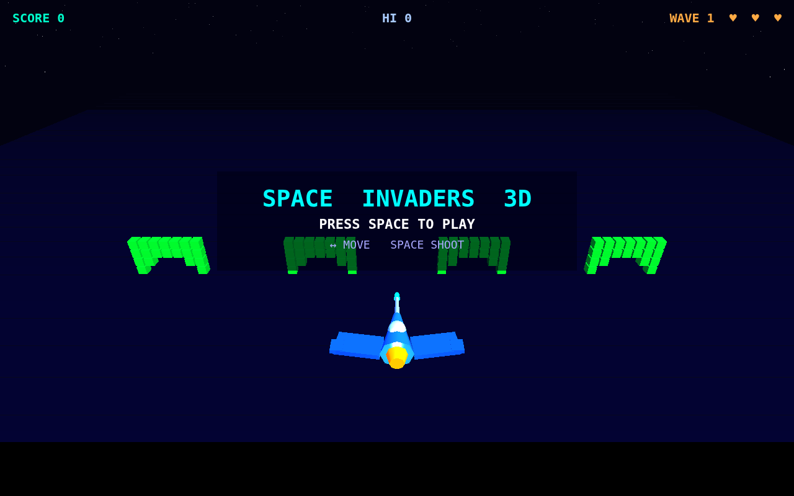

### [baseline-invaders.html](baseline-invaders.html)
A clean 2D reference implementation with a dark teal HUD shell, responsive canvas frame, starfield backdrop, modal start screen, score/lives/level counters, five colored invader ranks, and four destructible shields. It includes keyboard controls, Web Audio feedback, a three-wave win condition, and enemy movement/projectile pressure that ramps by level.

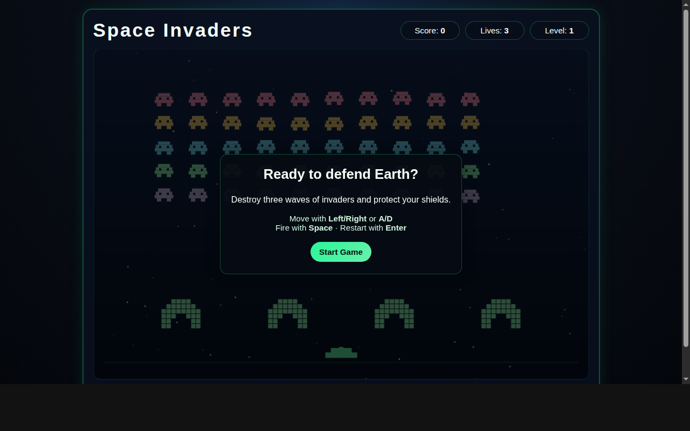

### [doctor-who-invaders.html](doctor-who-invaders.html)
A fullscreen Doctor Who-themed canvas game where the player pilots the TARDIS against ranked waves of Daleks, Cybermen, and The Master. It opens with a glowing title screen and enemy guide, then adds a scrolling starfield, destructible shields that carry damage between waves, a mystery TARDIS bonus ship, persistent high score, Web Audio march/shoot/explosion effects, and click/touch support for starting or advancing screens.

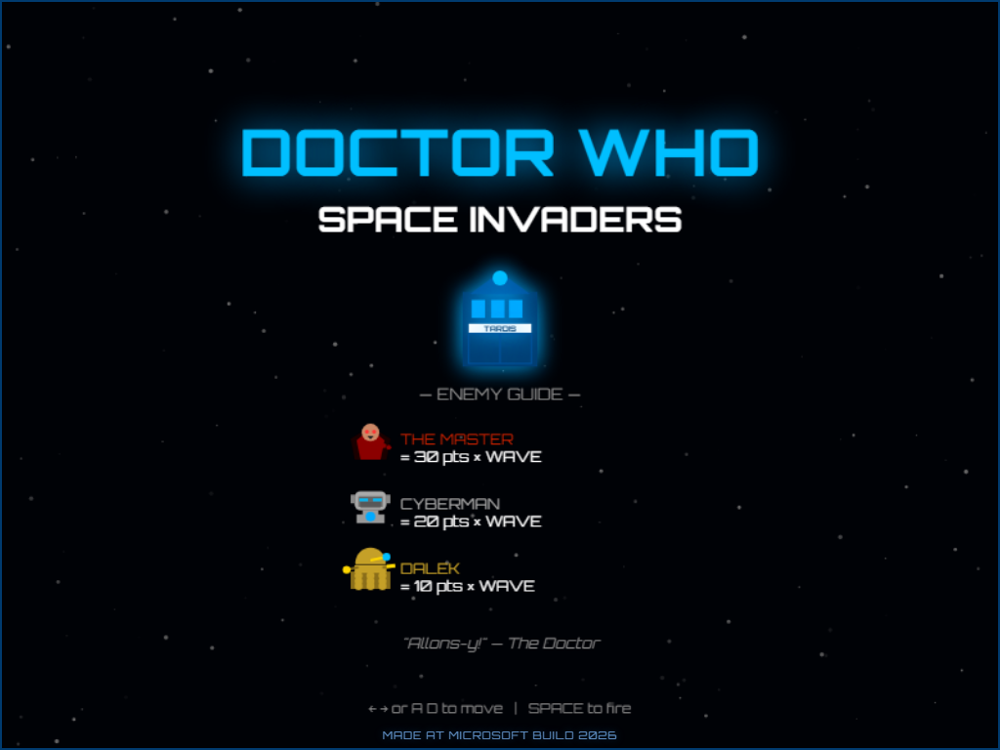

### [github-invaders.html](github-invaders.html)
A GitHub-flavored Invaders played in a tall 3:4 canvas, with contribution-graph greens mapped to enemy threat tiers, a dim contribution-grid background, decorative Octocat-style mascot art, monospace overlay screens, pause/game-over states, and a persistent local high score. The gameplay stays close to classic Invaders with one player bullet, multiple enemy bullets, regenerating bunkers every few waves, and a wave counter that increases speed and fire rate.

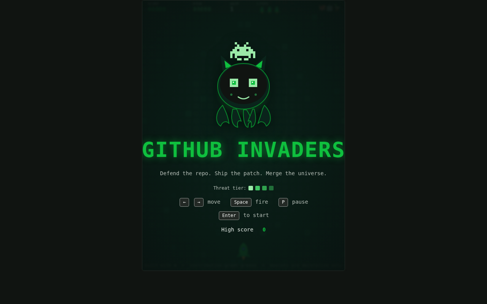

### [build-keynote-invaders.html](build-keynote-invaders.html)
A Microsoft Build 2026 edition framed like a dark keynote-stage control surface, with bright Build colors, glassy stat cards, a right-side theme/gameplay/controls briefing, and a live canvas embedded in the main panel. It plays as a lane-defense version with neon-blue shots, destructible shields, pause support, wave progression, and enemy speed/projectile activity that climbs as the Build stage gets busier.

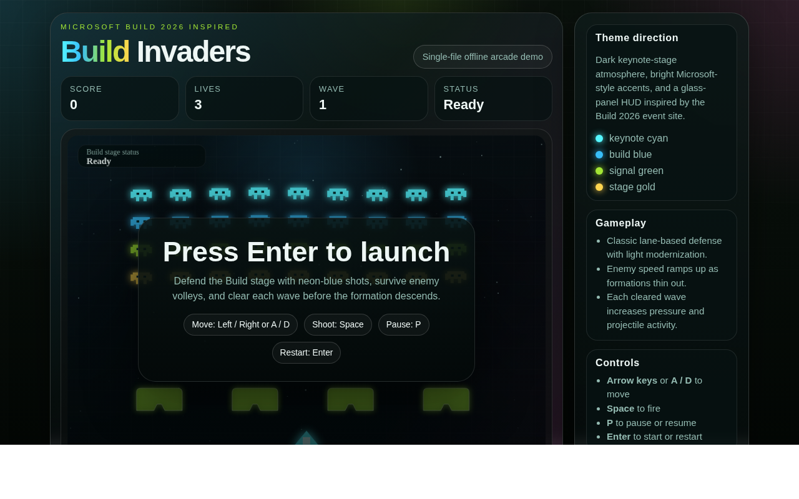

### [build-vibrant-invaders.html](build-vibrant-invaders.html)
A more dashboard-like Build theme study with oversized "Space Invaders Keynote Defense" hero typography, live telemetry cards, a controls panel, high-score tracking, and the playable canvas lower on the page. The arcade layer includes wave resets, crumbling shields, pause/resume controls, local high-score storage, and increasingly aggressive invader waves inside a polished navy/purple conference UI.

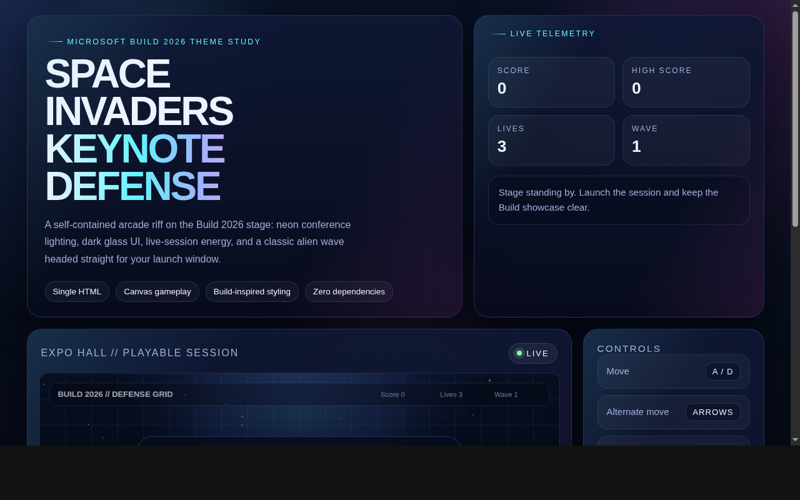

### [build-2026-light-invaders.html](build-2026-light-invaders.html)
A light-mode Build 2026 variant that wraps the game in a soft white/lavender event page with the four-square Microsoft mark, a violet-to-cyan title, and a live countdown to the conference. The playable canvas includes translucent HUD pills, pause and mute controls, Web Audio effects, local high-score storage, wave-clear overlays, a bonus UFO, and a compact "defend the dev cloud" framing.

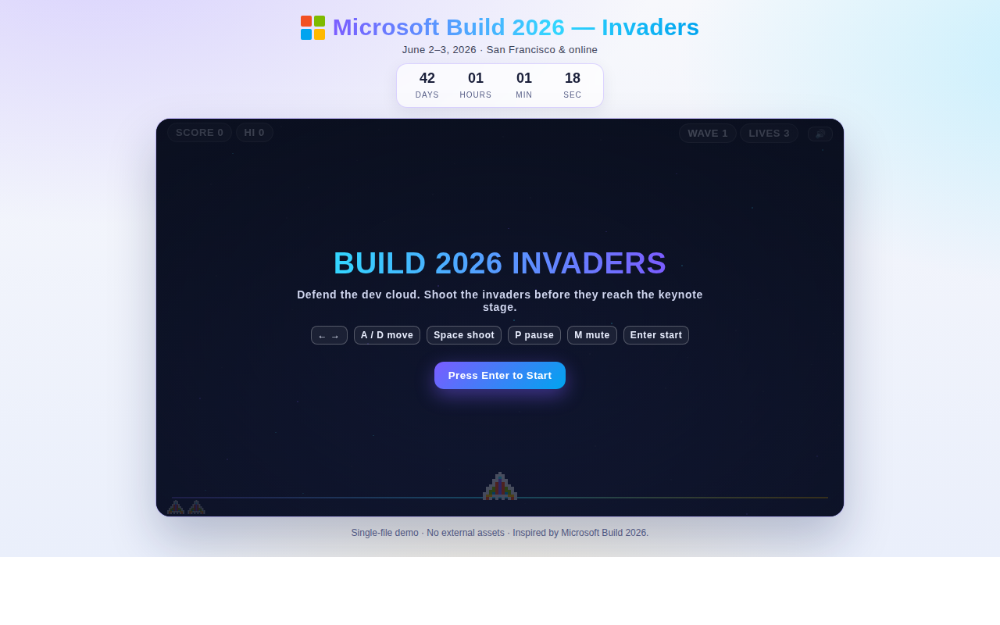

### [blockcraft-invaders.html](blockcraft-invaders.html)
A chunky Minecraft-flavored raid with a three-column page shell, blocky Overworld sky, mob codex, stat cards, keyboard and touch controls, sound/mute and reduced-effects toggles, and a central defense grid. It is one of the most feature-heavy samples: five raid levels, hearts, destructible wall shields, pickups for health/rapid/spread fire, particle effects, screen shake, adaptive chiptune-style audio, local best-score/best-level storage, boss-like late waves, and a victory finale.

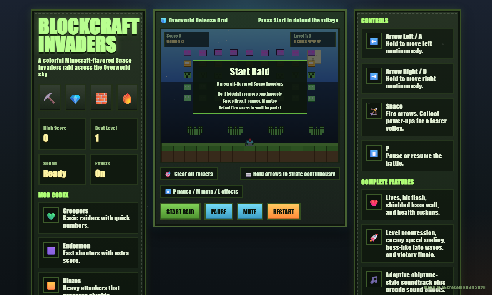

### [classic-arcade-invaders.html](classic-arcade-invaders.html)
A pixel-first classic recreation rendered on an 800×600 canvas with crisp scaling, sparse stars, score legend, hi-score line, and the familiar "Press Enter to Play" title screen. It implements authentic-feeling sprite proportions for enemies, player, and UFO, four destructible barriers built from block grids, single-shot player fire, enemy volleys, pause/restart keys, and the closest 1978 arcade feel in the gallery.

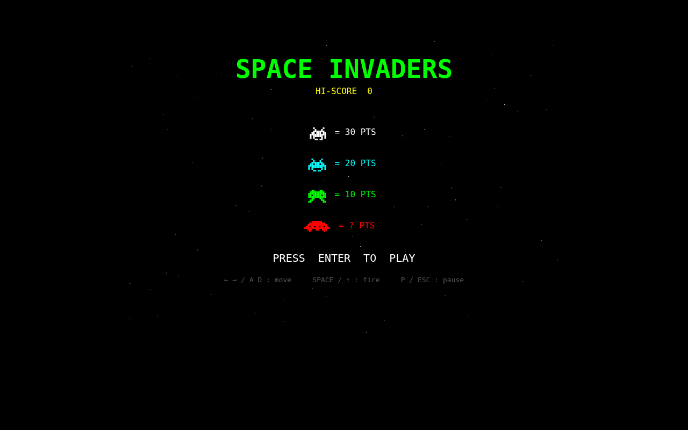

### [crt-cabinet-invaders.html](crt-cabinet-invaders.html)
The classic arcade variant presented inside a simulated cabinet, with a rounded CRT bezel, scanline overlay, green phosphor glow, cabinet footer label, and the "Press Start 2P" pixel font. The game itself keeps the same sparse starfield, sprite score legend, UFO target, keyboard controls, and arcade pacing as `classic-arcade-invaders.html`, but the cabinet treatment makes it feel like a vintage machine on the show floor.

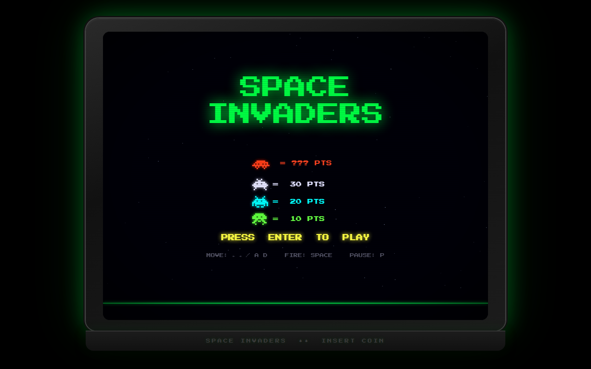

### [cosmo-cruiser-invaders.html](cosmo-cruiser-invaders.html)
A colorful retro-future variant with rounded HUD cards, a big framed canvas, pastel saucer enemies, drifting stars, decorative city towers, cyan shield blocks, and large touch-friendly controls for moving and firing. It supports keyboard or touch play, wave/lives/status tracking, start/game-over overlays, and a glossy sci-fi look that feels more like a mobile arcade cabinet than a strict 1978 remake.

Some bugs to work out, alien collisions not working against the shields.

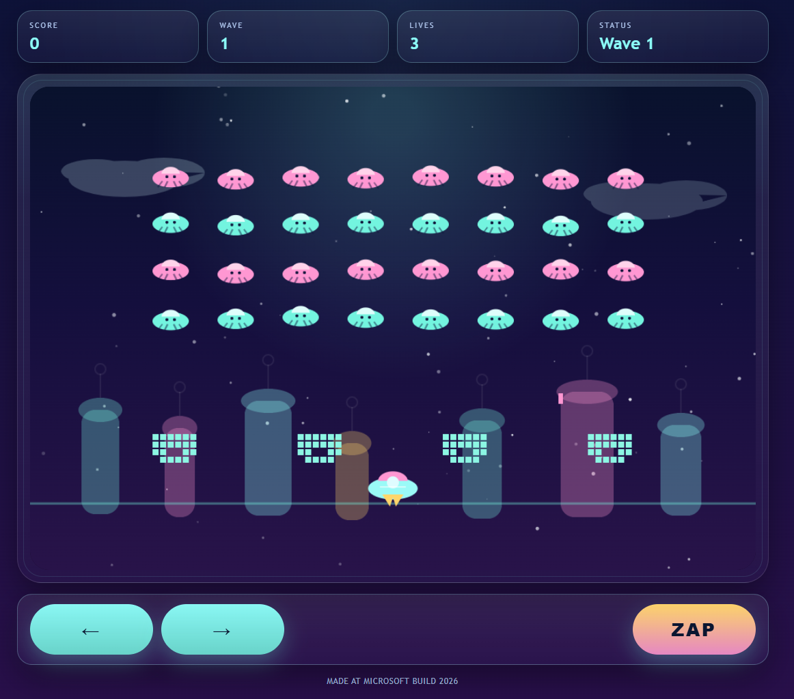

### [frogger.html](frogger.html)
A Frogger-inspired crossing-defense remix that keeps the Space Invaders formation pressure while replacing the battlefield with midnight river skies, painted road lanes, neon traffic critters, and a frog launcher guarding the crossing. It includes score/high-score/lives/wave HUD tracking, enemy volleys, particle bursts, escalating five-wave progression, and keyboard controls for movement, firing, and restart.

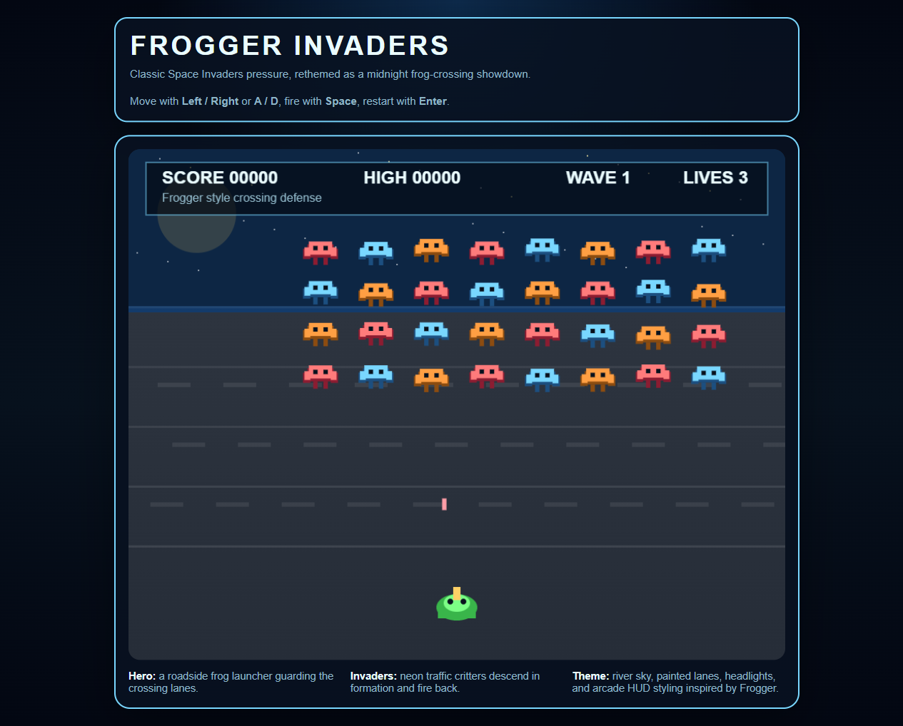
